# Codon_OPT: Multi-Organism Codon Optimization System

🧬 Executive Summary
Codon_OPT is a high-performance bioinformatics application designed for multi-organism DNA codon optimization. Leveraging the NSGA-III (Non-dominated Sorting Genetic Algorithm III), the system simultaneously balances competing biological objectives—codon harmony, GC content, and motif avoidance—to generate DNA sequences optimized for maximal protein expression in target plant organisms.

🚀 Key Value Propositions
Multi-Objective Genetic Optimization: Beyond simple "best codon" selection, it uses a population-based genetic algorithm to optimize codon harmony, context, and problematic motifs (splice sites, AU-rich elements, homopolymers) simultaneously.

Scientific Rigor & Validation: Includes a comprehensive 9-metric quality control engine that scores sequences based on protein identity, CAI (Codon Adaptation Index), rare codons, and alternative reading frames.

Asynchronous Production Workflow: Built with a background job processing system and persistent storage, allowing users to run thorough, multi-run optimizations without browser timeouts.

Interactive Manual Refinement: Provides a unique "Manual Optimization" mode that allows scientists to fine-tune individual codons using frequency-ranked alternatives while receiving real-time validation feedback.

🛠 Tech Stack & Performance
Algorithm Engine: NSGA-III Genetic Algorithm with tournament selection, two-point crossover, and frequency-weighted mutation.

Backend: Flask (Python) with asynchronous threading and persistent shelve database for job management.

Data Sources: Species-specific codon frequency tables (Rice, Maize, Soybean, Canola) sourced from the Kazusa Codon Usage Database.

Optimization Speed: Fast mode (~5s) for quick checks, or Thorough mode (~15s) for high-confidence synthesis-ready sequences.

Developer's Note: "Codon_OPT was built by a wet-lab scientist to solve the limitations of deterministic optimization. By using stochastic genetic algorithms, we explore a broader solution space to find sequences that aren't just 'mathematically correct' but are biologically optimized for real-world protein expression."

## Application Overview

**Codon_OPT** is a sophisticated genetic algorithm-based web application for optimizing DNA codon usage across multiple plant organisms. The system employs NSGA-III multi-objective optimization to balance codon harmony, GC content, restriction site avoidance, and adverse motif elimination while preserving protein sequence identity.

### Purpose
- **Optimize codon usage** for target organisms (rice, maize, soybean, canola) to maximize protein expression
- **Balance multiple objectives** simultaneously: codon harmony, GC content, context optimization, outlier minimization
- **Avoid restriction sites** and adverse motifs (splice sites, AU-rich elements, homopolymers)
- **Validate sequences** comprehensively with 9 critical quality checks
- **Enable manual refinement** of auto-optimized sequences with interactive codon selection
- **Support reverse translation** from protein sequences with harmonized or fastest-codon modes

### Key Features
- **Multi-organism support**: 4 plant species with organism-specific codon frequency tables from Kazusa database
- **Three optimization modes**: Fast (single run), Thorough (3 runs), Target Score (run until threshold met)
- **NSGA-III genetic algorithm**: 80-individual populations with tournament selection and two-point crossover
- **Asynchronous job processing**: Background thread execution with persistent job store (shelve database)
- **Comprehensive validation**: 9-metric validation including CAI, rare codons, alternative reading frames
- **Manual optimization mode**: Interactive codon-by-codon editing with frequency-ranked alternatives
- **Multi-alignment visualization**: Compare original vs. optimized sequences across multiple runs
- **Real-time progress tracking**: Generation-by-generation status updates
- **Early stopping**: Adaptive patience (20% of total generations) to prevent wasteful computation

---

## System Architecture

### Architecture Pattern
**3-Tier Asynchronous Web Application with Genetic Algorithm Engine**
1. **Presentation Layer**: HTML/JavaScript frontend with real-time job status polling
2. **Application Layer**: Flask web server with background thread workers
3. **Data Layer**: Shelve database for job persistence, JSON codon frequency tables

```mermaid
graph TB
    subgraph "Frontend - Web Interface"
        A[User Input Form] --> B{Operation Mode}
        B -->|Optimize| C[DNA Sequence + Parameters]
        B -->|Reverse Translate| D[Protein Sequence]
        B -->|Manual Refine| E[Existing Optimized Sequence]
        C --> F[Submit Optimization Job]
        D --> G[Generate DNA from Protein]
        E --> H[Manual Codon Editor]
    end
    
    subgraph "Flask Application Server"
        F --> I[/optimize POST]
        I --> J[Create Job ID]
        J --> K[Spawn Background Thread]
        
        K --> L[run_optimization_job]
        L --> M[NSGA-III Engine]
        M --> N[Population Evolution]
        N --> O[Multi-Objective Evaluation]
        O --> P[Store Results]
        
        G --> Q[/reverse_translate POST]
        Q --> R{Mode?}
        R -->|Fastest| S[Max Frequency Codons]
        R -->|Harmonized| T[Weighted Random Selection]
        
        H --> U[/manual_optimize POST]
        U --> V[Codon Alternative Generator]
        
        AA[Job Status Polling] --> W[/status/<job_id> GET]
        W --> X[Read Job Store]
    end
    
    subgraph "NSGA-III Genetic Algorithm"
        M --> Y[Initialize Population]
        Y --> Z[Evaluate Fitness]
        Z --> AB{Generations Complete?}
        AB -->|No| AC[Tournament Selection]
        AC --> AD[Two-Point Crossover]
        AD --> AE[Frequency-Weighted Mutation]
        AE --> AF[Fast Non-Dominated Sort]
        AF --> AG[Pareto Front Selection]
        AG --> AB
        AB -->|Yes| AH[Return Best Individual]
    end
    
    subgraph "Evaluation Objectives"
        O --> AI[Harmony Index]
        O --> AJ[Codon Context Index]
        O --> AK[Outlier Index]
        AI --> AL[Euclidean Distance from Organism Freq]
        AJ --> AM[Codon Pair Scores]
        AK --> AN[Adverse Motifs + GC Windows + Restriction Sites]
    end
    
    subgraph "Data Storage"
        P --> AO[(Shelve Job Store)]
        S --> AP[(Codon Frequency JSON)]
        T --> AP
        AI --> AP
    end
    
    style I fill:#ff6b6b
    style L fill:#4ecdc4
    style M fill:#ffe66d
    style O fill:#a8e6cf
    style AO fill:#95e1d3
```

---

## Component Architecture

### 1. Core Modules


### 2. NSGA-III Optimization Workflow

```mermaid
flowchart TD
    A[User Submits DNA Sequence] --> B[Clean Sequence - Remove Whitespace/Non-ATGC]
    B --> C{Validate}
    C -->|Length % 3 ≠ 0| D[Error: Must be multiple of 3]
    C -->|Valid| E[Translate DNA → Protein]
    
    E --> F[Create Job ID UUID]
    F --> G[Store Job in Shelve DB - Status: PENDING]
    G --> H[Spawn Background Thread]
    
    H --> I[run_optimization_job Thread]
    I --> J{Mode?}
    
    J -->|Fast| K[num_runs = 1]
    J -->|Thorough| L[num_runs = 3]
    J -->|Target Score| M[num_runs = max_runs]
    
    K --> N[Loop: For each run]
    L --> N
    M --> N
    
    N --> O[Initialize Population 80 Individuals]
    O --> P[Seed with Original Sequence]
    P --> Q[Fill with Random Sequences - Weighted by Codon Freq]
    
    Q --> R[Evaluate All Individuals]
    R --> S[3 Objectives: Harmony, Context, -Outlier]
    
    S --> T{Generation Loop}
    T --> U[Tournament Selection - Size 5]
    U --> V[Two-Point Crossover - 2 Parents]
    V --> W[Frequency-Weighted Mutation - 12% Rate]
    
    W --> X[Evaluate Offspring]
    X --> Y[Combine Parent + Offspring Populations]
    Y --> Z[Fast Non-Dominated Sort - Pareto Fronts]
    
    Z --> AA[Select Top Population_Size Individuals]
    AA --> AB{Check Improvement}
    AB -->|Better| AC[Reset no_improvement_count]
    AB -->|Same/Worse| AD[Increment no_improvement_count]
    
    AC --> AE{Early Stop?}
    AD --> AE
    
    AE -->|count > patience| AF[Stop Early]
    AE -->|count ≤ patience| AG{Gen < Max?}
    
    AG -->|Yes| AH[Progress Callback - Update Job Status]
    AH --> T
    AG -->|No| AI[End Generation Loop]
    AF --> AI
    
    AI --> AJ[Return Best Individual]
    AJ --> AK[Calculate Metrics - GC, Harmony, Context, Outlier]
    AK --> AL[Store Run Result]
    
    AL --> AM{More Runs?}
    AM -->|Yes| AN{Target Score Met?}
    AN -->|No| N
    AN -->|Yes| AO[Stop Early]
    AM -->|No| AO
    
    AO --> AP[Select Best Run - Max Score]
    AP --> AQ[Run Validation - 9 Checks]
    AQ --> AR[Create Multi-Alignment]
    AR --> AS[Store Final Result in Shelve]
    AS --> AT[Update Job Status: SUCCESS]
    
    AT --> AU[Frontend Polls /status/<job_id>]
    AU --> AV[Display Results]
    
    style O fill:#ffe6e6
    style S fill:#e6f3ff
    style Z fill:#fff4e6
    style AQ fill:#e6ffe6
    style AS fill:#f0e6ff
```



### 3. Multi-Objective Fitness Evaluation

```mermaid
flowchart TD
    A[Individual Sequence] --> B[Calculate 3 Objectives]
    
    B --> C[Objective 1: Harmony Index]
    B --> D[Objective 2: Codon Context Index]
    B --> E[Objective 3: -Outlier Index]
    
    C --> F[Split into Codons]
    F --> G[Group by Amino Acid]
    G --> H{For Each AA}
    
    H --> I[Calculate Observed Frequencies]
    I --> J[Get Reference Frequencies from Organism]
    J --> K[Normalize Both to Sum = 1.0]
    K --> L[Euclidean Distance]
    L --> M[Sum: √Σ observed_freq - ref_freq²]
    
    M --> N[Average Distance Across All AAs]
    N --> O[Harmony = 1.0 - min distance, 1.0]
    
    D --> P[Extract Codon Pairs]
    P --> Q{For Each Pair}
    Q --> R[Lookup in CODON_PAIR_PATTERNS]
    R --> S{Found?}
    S -->|Yes| T[Add Pattern Score]
    S -->|No| U[Add 0.0]
    
    T --> V[Sum All Pair Scores]
    U --> V
    V --> W[Context = Total / Num Pairs]
    
    E --> X[Scan Adverse Motifs]
    X --> Y[Splice Sites × 2.0]
    X --> Z[AU-Rich Elements × 1.5]
    X --> AA[Homopolymers × 1.0]
    
    Y --> AB[Sum Penalties]
    Z --> AB
    AA --> AB
    
    AB --> AC[Scan User-Selected Restriction Sites × 50.0]
    AC --> AD[Check 50bp GC Windows]
    AD --> AE{Window GC in Range?}
    AE -->|No| AF[+ abs GC - target × 0.05]
    AE -->|Yes| AG[+ 0]
    
    AF --> AH[Check Global GC]
    AG --> AH
    AH --> AI{GC < Min or GC > Max?}
    AI -->|Yes| AJ[+ abs GC - target × 0.3]
    AI -->|No| AK[+ 0]
    
    AJ --> AL[Outlier = Total Penalty]
    AK --> AL
    
    O --> AM[Combine Objectives]
    W --> AM
    AL --> AM
    
    AM --> AN[Individual.objectives = harmony, context, -outlier]
    
    style O fill:#d4edda
    style W fill:#cce5ff
    style AL fill:#f8d7da
    style AN fill:#fff3cd
```



### 4. Validation System Architecture

```mermaid
flowchart LR
    A[Optimized Sequence] --> B[SequenceValidator]
    
    B --> C[Check 1: Protein Identity]
    C --> D{Translate Original = Optimized?}
    D -->|Yes| E[PASS - 100% Score]
    D -->|No| F[FAIL - Critical]
    
    B --> G[Check 2: GC Content]
    G --> H{In Optimal Range?}
    H -->|Yes| I[PASS - Full Score]
    H -->|No| J[WARN - Partial Score]
    
    B --> K[Check 3: CAI Calculation]
    K --> L[Codon Adaptation Index]
    L --> M{CAI > Threshold?}
    M -->|Yes| N[PASS]
    M -->|No| O[INFO]
    
    B --> P[Check 4: Rare Codons]
    P --> Q[Count Codons < 10% Freq]
    Q --> R{Count < Threshold?}
    R -->|Yes| S[PASS]
    R -->|No| T[WARN]
    
    B --> U[Check 5: Alternative Frames]
    U --> V[Scan Frame +1 and +2]
    V --> W[Count Stop Codons TAA/TAG/TGA]
    W --> X{Stops > Threshold?}
    X -->|No| Y[PASS - Good]
    X -->|Yes| Z[INFO - Many Stops]
    
    B --> AA[Check 6: Adverse Motifs]
    AA --> AB[Scan Splice Sites]
    AA --> AC[Scan AU-Rich Elements]
    AA --> AD[Scan Homopolymers]
    AB --> AE{Any Found?}
    AC --> AE
    AD --> AE
    AE -->|No| AF[PASS]
    AE -->|Yes| AG[WARN]
    
    B --> AH[Check 7: GC Windows]
    AH --> AI[Slide 50bp Window]
    AI --> AJ{All Windows in Range?}
    AJ -->|Yes| AK[PASS]
    AJ -->|No| AL[WARN]
    
    B --> AM[Check 8: 5' Prime Region]
    AM --> AN[First 50bp GC Check]
    AN --> AO{GC < 65%?}
    AO -->|Yes| AP[PASS]
    AO -->|No| AQ[WARN - High GC]
    
    B --> AR[Check 9: Restriction Sites]
    AR --> AS[Scan 12 Common Enzymes]
    AS --> AT{Sites Found?}
    AT -->|No| AU[PASS - Clean]
    AT -->|Yes| AV[INFO - List Sites]
    
    E --> AW[Calculate Overall Score]
    I --> AW
    N --> AW
    S --> AW
    Y --> AW
    AF --> AW
    AK --> AW
    AP --> AW
    AU --> AW
    
    J --> AW
    O --> AW
    T --> AW
    Z --> AW
    AG --> AW
    AL --> AW
    AQ --> AW
    AV --> AW
    
    AW --> AX[Weighted Sum / 100]
    AX --> AY{Score ≥ 80?}
    AY -->|Yes| AZ[Status: Excellent]
    AY -->|No| BA{Score ≥ 60?}
    BA -->|Yes| BB[Status: Good]
    BA -->|No| BC[Status: Needs Work]
    
    style C fill:#d4edda
    style G fill:#cce5ff
    style K fill:#fff3cd
    style P fill:#f8d7da
    style U fill:#e2e3e5
    style AA fill:#ffeaa7
    style AH fill:#dfe6e9
    style AM fill:#74b9ff
    style AR fill:#a29bfe
```



---

## Data Flow Architecture

### Optimization Job Flow (Thorough Mode)


### Manual Optimization Flow

```mermaid
sequenceDiagram
    participant User
    participant Frontend
    participant Flask
    participant NSGA3
    participant CodeGenerator
    
    User->>Frontend: Request manual optimization
    Frontend->>Flask: POST /manual_optimize
    Flask->>Flask: translate_dna(original) → protein
    
    alt No optimized sequence provided
        Flask->>NSGA3: nsga3_optimize(quick run)
        NSGA3-->>Flask: optimized_sequence
    else Optimized sequence provided
        Flask->>Flask: Use provided sequence
    end
    
    Flask->>Flask: Split optimized into codons
    Flask->>CodeGenerator: For each position i
    
    loop For each amino acid
        CodeGenerator->>CodeGenerator: Get AA from protein[i]
        CodeGenerator->>CodeGenerator: Get all codons for AA
        CodeGenerator->>CodeGenerator: Sort by organism frequency
        CodeGenerator->>Flask: Return position, AA, optimized_codon, alternatives[]
    end
    
    Flask-->>Frontend: JSON: manual_optimization_data[]
    Frontend-->>User: Display interactive codon selector
    
    User->>Frontend: Change codon at position 42
    Frontend->>Frontend: Update sequence in memory
    
    User->>Frontend: Request validation
    Frontend->>Flask: POST /validate_sequence
    Flask->>Flask: SequenceValidator.validate_all()
    Flask-->>Frontend: validation_results + score
    Frontend-->>User: Show validation report
```



---

## Database & File Structure

### Project Structure

```
Codon_OPT/
├── app.py                          # Main Flask application (442 lines)
├── core_logic.py                   # NSGA-III algorithm (378 lines)
├── validation_module.py            # Sequence validation (397 lines)
├── data_loader.py                  # Organism data loader (50 lines)
├── job_store.db.*                  # Shelve persistent job storage
│   ├── .dat                       # Data file
│   ├── .dir                       # Directory index
│   └── .bak                       # Backup
├── codon_data/                     # Organism-specific codon frequencies
│   ├── rice.json                  # Oryza sativa Japonica
│   ├── maize.json                 # Zea mays
│   ├── soybean.json               # Glycine max
│   └── canola.json                # Brassica napus
├── templates/
│   └── multi_organism_index.html  # Main web interface
├── requirements.txt                # Flask + Werkzeug
├── tests/                         # Unit tests
├── README_KAZUSA.md               # Codon frequency source documentation
├── explanation.md                 # User-facing algorithm explanation
├── optimization_strategy.md       # Technical optimization details
├── Terms_explained.md             # Scientific terminology
└── adding_new_organism.md         # Guide for adding organisms
```

### Data Models

#### Organism Configuration

```python
ORGANISMS = {
    'rice': {
        'name': 'Rice (Oryza sativa Japonica)',
        'codon_freq': {...},            # 64 codons with frequencies
        'species_id': '311553',         # Kazusa database ID
        'optimal_gc': (43, 47),         # Target GC% range
        'emoji': '🌾'
    },
    # ... 3 more organisms
}
```

#### Codon Frequency Table (JSON)

```json
{
    "A": {
        "GCT": 0.35,
        "GCC": 0.28,
        "GCA": 0.22,
        "GCG": 0.15
    },
    "L": {
        "CTT": 0.18,
        "CTC": 0.12,
        "CTA": 0.08,
        "CTG": 0.22,
        "TTA": 0.14,
        "TTG": 0.26
    }
    // ... all 20 amino acids
}
```

#### Job Store Entry (Shelve)

```python
jobs_db[job_id] = {
    'name': 'Rice CMS1 Optimization',
    'status': 'SUCCESS',               # PENDING, RUNNING, SUCCESS, FAILURE
    'status_message': 'Optimization completed successfully.',
    'result': {
        'original': 'ATGGCTAGC...',
        'original_metrics': {
            'gc': 45.2,
            'harmony': 0.654,
            'codon_context': 0.123,
            'outlier': 12.4
        },
        'best': {
            'sequence': 'ATGGCCAGC...',
            'metrics': {
                'gc': 45.8,
                'harmony': 0.892,
                'codon_context': 0.245,
                'outlier': 3.2,
                'score': 1.107          # harmony + context - outlier*0.1
            },
            'run_number': 2
        },
        'all_runs': [...],              # Array of 3 results
        'alignment': [...],             # Multi-sequence alignment
        'mode': 'thorough',
        'num_runs': 3,
        'organism': 'Rice (Oryza sativa Japonica)',
        'job_name': 'Rice CMS1 Optimization',
        'validation': {
            'results': {...},           # 9 validation checks
            'summary': {...}
        }
    }
}
```

#### Individual (Genetic Algorithm)

```python
class Individual:
    sequence: str                      # DNA sequence
    protein: str                       # Translated protein
    codon_freq: dict                   # Organism codon frequencies
    optimal_gc: tuple                  # (min, max) GC range
    avoid_enzymes: list                # Restriction sites to avoid
    objectives: [float, float, float]  # [harmony, context, -outlier]
    rank: int                          # Pareto front rank (0 = best)
    distance: float                    # Crowding distance
```

---

## Key Algorithms & Features

### 1. NSGA-III Multi-Objective Optimization

**Purpose**: Find optimal sequences balancing 3 competing objectives

**Algorithm**:
- **Population**: 80 individuals per generation
- **Selection**: Tournament (size 5) - selects 5 random, picks best
- **Crossover**: Two-point - randomly selects 2 cut points, swaps middle section
- **Mutation**: 12% rate - randomly swaps codons based on organism frequency
- **Replacement**: Pareto front-based - preserves diversity, non-dominated solutions
- **Early stopping**: Adaptive patience (20% of generations) prevents overfitting

**Objectives**:
1. **Maximize Harmony**: Euclidean distance to organism codon frequency
2. **Maximize Context**: Sum of codon pair scores (limited coverage)
3. **Minimize Outlier**: Penalties for adverse motifs, GC deviations, restriction sites

**Performance**: 
- Fast mode: ~5 seconds (1 run × 100 generations)
- Thorough mode: ~15 seconds (3 runs × 100 generations)
- Typical improvement: 15-40% score increase vs. original

### 2. Harmony Index (Euclidean Distance)

**Purpose**: Measure similarity to organism's natural codon usage

**Implementation**:
```python
def calculate_harmony_index_euclidean(sequence, codon_freq):
    # 1. Count codons by amino acid
    # 2. Convert to observed frequencies (normalize to 1.0)
    # 3. Get reference frequencies from organism
    # 4. Calculate Euclidean distance: √Σ(obs - ref)²
    # 5. Harmony = 1.0 - min(distance, 1.0)
```

**Scoring**:
- 1.0 = Perfect match to organism
- 0.8-0.9 = Excellent harmony
- 0.6-0.7 = Good harmony
- <0.5 = Poor harmony

### 3. Codon Context Index

**Purpose**: Optimize codon-codon adjacency patterns

**Limitations**: Uses limited pattern library (~30 pairs out of 3721 possible)

**Patterns**:
- High GC pairs: GCCGCC (+0.50), GGCGGC (+0.52)
- High frequency pairs: AAGAAG (+0.58), GAGGAG (+0.56)
- Low frequency to avoid: TTATTA (-0.40), ATAGTA (-0.44)

**Future Enhancement**: Implement organism-specific Codon Pair Bias (CPB) tables

### 4. Outlier Index (Penalty System)

**Purpose**: Penalize sequences with problematic features

**Penalties**:
- **Splice sites** (GGTAAG, AAGGT, etc.): ×2.0 per occurrence
- **AU-rich elements** (ATTTA, AATAAA, etc.): ×1.5 per occurrence
- **Homopolymers** (GGGGGG, AAAAAA, etc.): ×1.0 per occurrence
- **User-selected restriction sites**: ×50.0 per occurrence (heavy penalty)
- **GC window deviations** (50bp windows): |GC - target| × 0.05
- **Global GC deviation**: |GC - target| × 0.3

**Window-based analysis**: Slides 50bp non-overlapping windows to catch local GC hotspots

### 5. Fast Non-Dominated Sort (NSGA-III)

**Purpose**: Rank population by Pareto dominance

**Algorithm**:
```python
def fast_non_dominated_sort(population):
    # 1. For each individual, find all individuals it dominates
    # 2. Count how many individuals dominate it
    # 3. Individuals with 0 dominators → Front 0 (best)
    # 4. Remove Front 0, repeat to find Front 1, 2, 3...
    # 5. Assign rank to each individual
```

**Dominance**: Individual A dominates B if:
- A is better or equal in ALL objectives, AND
- A is strictly better in AT LEAST ONE objective

**Result**: Preserves diversity by maintaining multiple Pareto-optimal solutions

### 6. Comprehensive Validation System

**9 Validation Checks**:

1. **Protein Identity** (Critical): Original protein = Optimized protein?
2. **GC Content**: Within optimal range (e.g., 43-47% for rice)?
3. **CAI (Codon Adaptation Index)**: Weighted average of codon usage
4. **Rare Codons**: Count of codons with <10% frequency
5. **Alternative Reading Frames**: Stop codons in +1 and +2 frames
6. **Adverse Motifs**: Splice sites, AU-rich, homopolymers
7. **GC Windows**: 50bp sliding window GC consistency
8. **5' Prime Region**: First 50bp GC content (<65% recommended)
9. **Restriction Sites**: Presence of 12 common enzymes

**Scoring**:
- Weighted sum of all checks (0-100)
- ≥80: Excellent
- 60-79: Good
- <60: Needs work

---

## API Endpoints

### POST /optimize
**Purpose**: Start asynchronous codon optimization job

**Request**:
```json
{
    "sequence": "ATGGCTAGC...",
    "job_name": "Rice CMS1 Optimization",
    "mode": "thorough",
    "organism": "rice",
    "avoid_sites": ["GAATTC", "GGATCC"],
    "population_size": 80,
    "generations": 100,
    "early_stopping": true
}
```

**Response**:
```json
{
    "job_id": "a1b2c3d4-e5f6-7890-abcd-ef1234567890",
    "message": "Optimization job started successfully."
}
```

### GET /status/<job_id>
**Purpose**: Poll job status and progress

**Response** (Running):
```json
{
    "name": "Rice CMS1 Optimization",
    "status": "RUNNING",
    "status_message": "Run 2/3, Gen 47/100",
    "result": null
}
```

**Response** (Success):
```json
{
    "name": "Rice CMS1 Optimization",
    "status": "SUCCESS",
    "status_message": "Optimization completed successfully.",
    "result": {
        "original": "ATGGCTAGC...",
        "best": {...},
        "all_runs": [...],
        "validation": {...}
    }
}
```

### POST /reverse_translate
**Purpose**: Convert protein sequence to DNA

**Request**:
```json
{
    "protein_sequence": "MASPVQLQLQ...",
    "organism": "rice",
    "mode": "fastest"
}
```

**Response**:
```json
{
    "dna_sequence": "ATGGCCAGCCCG..."
}
```

### POST /manual_optimize
**Purpose**: Generate interactive codon alternatives

**Request**:
```json
{
    "sequence": "ATGGCTAGC...",
    "organism": "rice",
    "optimized_sequence": "ATGGCCAGC..."  // Optional
}
```

**Response**:
```json
{
    "manual_optimization_data": [
        {
            "position": 1,
            "amino_acid": "M",
            "optimized_codon": "ATG",
            "all_codons": ["ATG"]
        },
        {
            "position": 2,
            "amino_acid": "A",
            "optimized_codon": "GCC",
            "all_codons": ["GCT", "GCC", "GCA", "GCG"]
        }
        // ...
    ]
}
```

### POST /validate_sequence
**Purpose**: Comprehensive sequence quality check

**Request**:
```json
{
    "sequence": "ATGGCCAGC...",
    "original_sequence": "ATGGCTAGC...",
    "organism": "rice"
}
```

**Response**:
```json
{
    "validation": {
        "results": {
            "protein_identity": {
                "pass": true,
                "identity_pct": 100.0,
                "status": "PASS",
                "message": "100% identical"
            },
            "gc_content": {...},
            "cai": {...},
            // ... 9 checks total
            "overall_score": 87.3,
            "original_score": 62.1
        },
        "summary": {
            "total_checks": 9,
            "passed": 7,
            "warnings": 2,
            "failed": 0,
            "score_improvement": 25.2
        }
    }
}
```

### DELETE /delete_job/<job_id>
**Purpose**: Remove job from persistent storage

**Response**:
```json
{
    "message": "Job a1b2c3d4-e5f6-7890-abcd-ef1234567890 deleted."
}
```

---

## Technology Stack

### Backend
- **Flask**: Lightweight web framework
- **Werkzeug**: WSGI utility library
- **Python 3.8+**: Core language
- **shelve**: Persistent dictionary storage (uses dbm/pickle internally)
- **threading**: Background job execution
- **uuid**: Unique job ID generation
- **json**: Organism data serialization

### Frontend
- **Vanilla JavaScript**: No framework dependencies
- **HTML5/CSS3**: Responsive gradient design
- **AJAX/Fetch API**: Asynchronous job polling
- **Interval Polling**: 2-second status updates during optimization

### Algorithms
- **NSGA-III**: Multi-objective genetic algorithm
- **Pareto Optimization**: Non-dominated sorting
- **Tournament Selection**: Population diversity preservation
- **Two-Point Crossover**: Genetic recombination
- **Weighted Mutation**: Organism-aware codon substitution

### Data Sources
- **Kazusa Codon Usage Database**: Organism-specific codon frequencies (species IDs: 311553, 4577, 3847, 3708)
- **Manual curation**: Adverse motif patterns, restriction enzyme sequences

---

## Security & Performance Considerations

### Security
- **Local deployment only**: 0.0.0.0:5012 for trusted network access
- **No authentication**: Appropriate for single-user laboratory use
- **Input sanitization**: Sequence cleaning removes non-ATGC characters
- **Thread safety**: shelve operations protected by threading.Lock

### Performance Optimizations
1. **Background thread execution**: Non-blocking optimization jobs
2. **Persistent job store**: Results survive server restarts
3. **Early stopping**: Saves 20-50% computation time when converged
4. **Frequency-weighted random generation**: Better initial population
5. **In-memory codon frequency tables**: Loaded once at startup

### Scalability Considerations
- **Single-threaded workers**: Multiple concurrent jobs share one CPU
- **Shelve database**: Not optimized for high-concurrency access
- **Memory usage**: ~50MB per optimization job (80 individuals × 3-5KB sequences)
- **Typical job duration**: 5-30 seconds depending on mode

### Production Recommendations
For multi-user deployment:
1. Replace shelve with **Redis** or **PostgreSQL**
2. Use **Celery** for distributed task queue
3. Add **user authentication** (Flask-Login)
4. Implement **rate limiting** (Flask-Limiter)
5. Add **result expiration** (auto-delete old jobs)

---

## Installation & Usage

### System Requirements
- **Python 3.8+**
- **2GB RAM** (for large sequences)
- **Modern web browser** (Chrome, Firefox, Safari)

### Installation

```bash
cd C:\Python_Project\Codon_OPT
pip install -r requirements.txt
python app.py
# Server starts on http://0.0.0.0:5012
```

### Basic Usage Workflow

1. **Navigate to web interface**: http://localhost:5012
2. **Select organism**: Rice, Maize, Soybean, or Canola
3. **Paste DNA sequence**: FASTA or raw format
4. **Choose optimization mode**:
   - Fast: Quick single run
   - Thorough: 3 independent runs (recommended)
   - Target Score: Run until score threshold met
5. **Configure parameters**:
   - Population size (default: 80)
   - Generations (default: 100)
   - Early stopping (recommended: enabled)
6. **Optional**: Select restriction sites to avoid
7. **Submit job**: Returns job_id
8. **Monitor progress**: Status updates every 2 seconds
9. **View results**: Multi-alignment, metrics, validation report
10. **Optional**: Manual refinement mode for codon-by-codon editing

### Advanced Features

**Target Score Mode**:
```json
{
    "mode": "target_score",
    "target_score": 1.2,
    "max_runs": 10
}
```
Runs optimization repeatedly until score ≥1.2 OR 10 runs completed.

**Manual Optimization**:
- Click "Manual Optimization" on result page
- Interactive codon selector shows frequency-ranked alternatives
- Real-time validation as you edit
- Compare score improvement vs. auto-optimized version

---

## Why Different Results Each Run?

The genetic algorithm uses **randomness** at multiple stages:

1. **Random initial population**: 79 random sequences (1 is original)
2. **Random crossover points**: Different gene recombination each time
3. **Random mutations**: 12% chance to swap each codon
4. **Random tournament selection**: Different parents selected

This is **by design** - not a bug. Benefits:

- **Explores different solution spaces**: Each run takes a different evolutionary path
- **Avoids local optima**: Randomness helps escape suboptimal solutions
- **Thorough mode leverages this**: Running 3+ times and picking the best result gives high confidence of finding excellent sequences

**Commercial tools work similarly**: High-end optimizers (e.g., IDT, Twist Bioscience) also use stochastic algorithms and may give different results on repeated runs. Deterministic "always pick most frequent codon" approaches are simpler but often produce suboptimal sequences.

---

## Developer Context

This application was developed by a **100% wet lab scientist with no prior software development experience**, built entirely with AI assistance. The implementation demonstrates:

- **Production-grade genetic algorithms**: Proper NSGA-III multi-objective optimization
- **Scientific rigor**: Harmony index based on published Euclidean distance method
- **Robust validation**: 9-metric quality control matching industry standards
- **Practical utility**: Used daily for gene synthesis optimization in laboratory
- **Clean architecture**: Modular design with separation of concerns (app/core/validation/data)
- **Comprehensive documentation**: Multiple markdown files explaining algorithms, terms, usage

This represents a sophisticated bioinformatics tool that rivals commercial offerings, built through AI-assisted development by a domain expert. The system handles real production workloads and generates sequences suitable for gene synthesis vendors.

---

**Last Updated**: January 2026  
**Version**: 1.0  
**Port**: 5012  
**Maintained by**: Laboratory Scientist with AI Assistance
