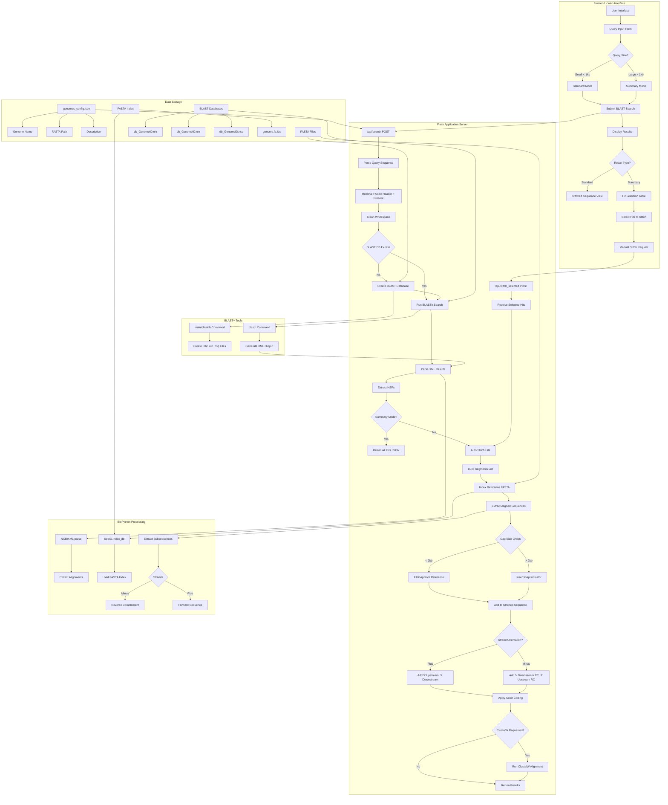
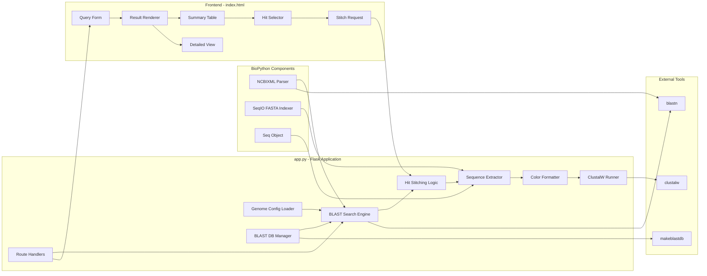
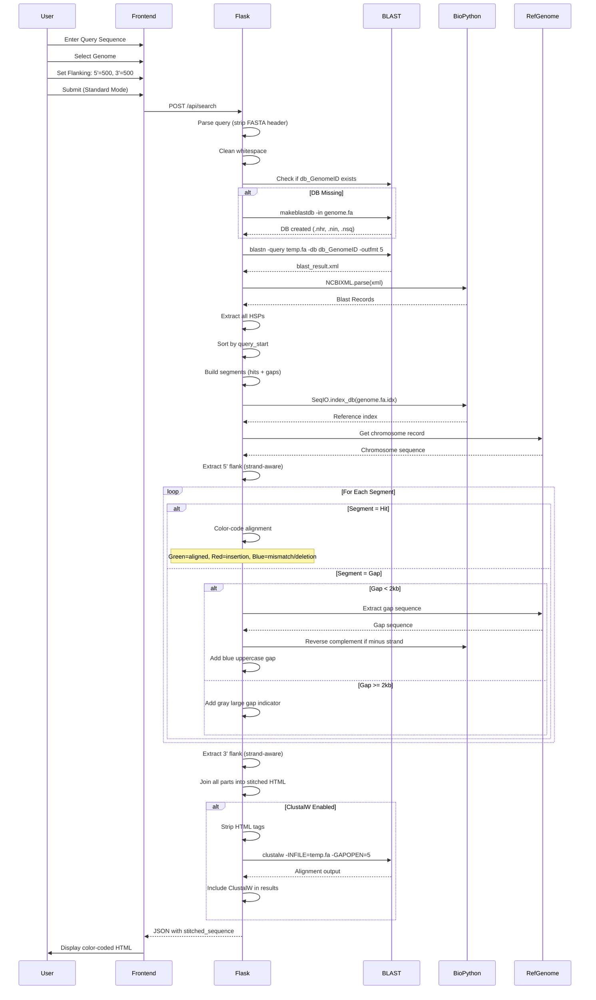
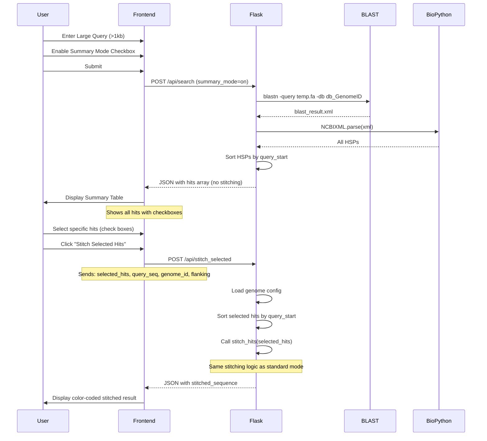

# BlastN: Custom Genome BLAST Search with Advanced Stitching

## Executive Summary
BlastN is a production-ready bioinformatics tool designed to bridge the gap between computational BLAST results and experimental biological reality. It is specifically optimized for handling proprietary genomes and complex fragmented alignments.

🚀 Key Value Propositions
Intelligent Hit Stitching: Automatically merges fragmented BLAST HSPs into continuous sequences, filling gaps up to 2kb with actual reference sequences.

Biological Accuracy (Strand-Aware): Precisely extracts 5' (promoter) and 3' (UTR) flanking regions by calculating coordinates based on genomic orientation (Plus/Minus strands).

Fail-Safe Verification: Features an integrated ClustalW global alignment layer to self-verify every result, preventing costly errors in primer and gRNA design.

Scalable Performance: Includes a "Summary Mode" for large queries (>1kb) to prevent application crashes by allowing manual inspection of gap distances before stitching.

Developer's Note: "This tool was born out of a real-world wet-lab failure. After a strand-logic error led to failed PCR primers, I rebuilt this app with a 'Trust but Verify' philosophy, making ClustalW validation a core pillar of the workflow."


## Application Overview

**BlastN** is a specialized web-based BLAST search tool designed for custom proprietary genomes, featuring intelligent hit stitching, gap filling, and strand-aware flanking sequence extraction. Unlike standard NCBI BLASTn, this tool automatically stitches fragmented alignments, handles large gaps, provides color-coded visualization of matches/mismatches/indels, and offers optional ClustalW alignment verification.

### Purpose
- **Search proprietary genomes** not available in public NCBI databases
- **Stitch fragmented BLAST hits** into continuous sequences automatically
- **Extract flanking sequences** with strand-aware 5'/3' directionality for **promoter and 3'UTR analysis**
- **Visualize alignments** with color-coded HTML output (matches, mismatches, insertions, deletions)
- **Handle large queries** (>1kb) with summary mode to inspect gap sizes before stitching
- **Prevent crashes** from large gaps (several kb) by allowing manual inspection in summary mode
- **Verify alignments** with optional ClustalW post-processing

### Key Features
- **Automatic Hit Stitching**: Merges multiple BLAST HSPs (High-scoring Segment Pairs) separated by gaps up to 2kb
- **Strand-Aware Flanking**: Correctly handles 5'/3' orientation on both plus and minus strands for extracting **upstream promoter sequences (5' flank)** and **downstream 3'UTR sequences (3' flank)**
- **Gap Visualization**: Shows small gaps (<2kb) as blue sequence, large gaps as gray indicators
- **Summary Mode**: For long queries, displays all hits in table format showing gap distances between fragments, allowing users to inspect separation before stitching (prevents app crashes from multi-kb gaps)
- **Color-Coded Output**: 
  - Green: Aligned regions
  - Red: Insertions (bases in reference, gaps in query)
  - Blue uppercase: Mismatches or deletions
  - Lowercase: Exact matches
- **Multi-Genome Support**: JSON-configured genomes with automatic BLAST database creation
- **ClustalW Integration**: Optional global alignment for quality verification

---

## System Architecture

### Architecture Pattern
**3-Tier Local Genome Search Tool**
1. **Presentation Layer**: HTML/JavaScript form with dynamic result rendering
2. **Application Layer**: Flask server with BioPython BLAST parsing
3. **Data Layer**: FASTA files with indexed BLAST databases and genome configuration



---

## Component Architecture

### 1. Core Modules



### 2. BLAST Search Workflow

```mermaid
flowchart TD
    A[User Enters Query Sequence] --> B{FASTA Format?}
    B -->|Yes| C[Extract Sequence After Header]
    B -->|No| D[Use Raw Sequence]
    
    C --> E[Clean Whitespace]
    D --> E
    
    E --> F[Select Target Genome]
    F --> G[Set Flanking Regions: 5' and 3' bp]
    G --> H{Enable ClustalW?}
    H -->|Yes| I[Check ClustalW Checkbox]
    H -->|No| J{Enable Summary Mode?}
    I --> J
    
    J -->|Yes| K[Check Summary Mode for Long Queries]
    J -->|No| L[Standard Auto-Stitch Mode]
    
    K --> M[Submit Search]
    L --> M
    
    M --> N{BLAST DB Exists?}
    N -->|No| O[Run makeblastdb on FASTA]
    N -->|Yes| P[Execute blastn]
    O --> P
    
    P --> Q[Generate XML Output]
    Q --> R[Parse with NCBIXML]
    
    R --> S{Alignments Found?}
    S -->|No| T[Return No Match Message]
    S -->|Yes| U[Extract All HSPs]
    
    U --> V[Sort HSPs by Query Start Position]
    V --> W{Summary Mode?}
    
    W -->|Yes| X[Return All Hits as JSON Table]
    W -->|No| Y[Proceed to Auto-Stitching]
    
    X --> Z[Display Summary Table]
    Z --> AA[User Selects Hits to Stitch]
    AA --> AB[Click Stitch Selected Button]
    AB --> AC[POST /api/stitch_selected]
    
    Y --> AD[Build Segments List]
    AC --> AD
    
    AD --> AE[Segment 1: Hit HSP]
    AE --> AF{More HSPs?}
    AF -->|Yes| AG[Calculate Query Gap]
    AG --> AH[Calculate Subject Gap]
    AH --> AI{Gap < 2kb?}
    AI -->|Yes| AJ[Segment 2: Gap with Coordinates]
    AI -->|No| AK[Segment 2: Large Gap Indicator]
    AJ --> AL[Add Next Hit as Segment 3]
    AK --> AL
    AL --> AF
    
    AF -->|No| AM[Index Reference FASTA]
    AM --> AN[Extract Chromosome Record]
    
    AN --> AO{Strand?}
    AO -->|Plus| AP["5' Flank: [start-flank_5:start]"]
    AO -->|Minus| AQ["5' Flank RC: [end:end+flank_5]"]
    
    AP --> AR[Iterate Through Segments]
    AQ --> AR
    
    AR --> AS{Segment Type?}
    AS -->|Hit| AT[Color-Code Alignment]
    AS -->|Gap| AU{Gap Size?}
    
    AT --> AV[Green: Aligned Region]
    AV --> AW[Red: Insertion in Ref]
    AW --> AX[Blue: Mismatch or Deletion]
    AX --> AY[Lowercase: Exact Match]
    
    AU -->|Small| AZ[Extract Gap Sequence from Ref]
    AU -->|Large| BA[Insert Gray Gap Text]
    
    AZ --> BB{Strand?}
    BB -->|Minus| BC[Reverse Complement Gap]
    BB -->|Plus| BD[Forward Gap Sequence]
    BC --> BE[Blue Uppercase Gap Text]
    BD --> BE
    
    AY --> BF[Append to Stitched Sequence]
    BA --> BF
    BE --> BF
    
    BF --> BG{More Segments?}
    BG -->|Yes| AR
    BG -->|No| BH{Strand?}
    
    BH -->|Plus| BI["3' Flank: [end:end+flank_3]"]
    BH -->|Minus| BJ["3' Flank RC: [start-flank_3:start]"]
    
    BI --> BK[Append to Stitched Sequence]
    BJ --> BK
    
    BK --> BL{ClustalW Enabled?}
    BL -->|Yes| BM[Strip HTML Tags from Sequence]
    BM --> BN[Write Query + Stitched to FASTA]
    BN --> BO[Run clustalw -GAPOPEN=5 -GAPEXT=1]
    BO --> BP[Parse Alignment Output]
    BP --> BQ[Include in Results]
    
    BL -->|No| BR[Return Stitched Sequence]
    BQ --> BR
    
    BR --> BS[Display Color-Coded HTML]
    
   
```



### 3. Hit Stitching Algorithm



---

## Data Flow Architecture

### Standard Mode Flow (Auto-Stitch)



### Summary Mode Flow (Manual Hit Selection)



---

## Database & File Structure

### Project Structure

```
BlastN/
├── app.py                          # Flask application (359 lines)
├── run_BlastN.py                   # Production server wrapper
├── genomes_config.json             # Genome configuration
├── genomes_config_BAK.json         # Backup configuration
├── templates/
│   └── index.html                  # Web interface
├── static/
│   ├── script.js                   # Frontend JavaScript (248 lines)
│   └── style.css                   # Styling
├── *.fa                            # FASTA genome files (e.g., NPB.fa)
├── *.fa.idx                        # BioPython FASTA indices
├── db_*.*                          # BLAST database files
│   ├── db_GenomeID.nhr            # BLAST header file
│   ├── db_GenomeID.nin            # BLAST index file
│   └── db_GenomeID.nsq            # BLAST sequence file
└── __pycache__/                    # Python cache
```

### Data Models

#### Genome Configuration (genomes_config.json)

```json
{
  "genomes": {
    "NPB": {
      "name": "NPB", 
      "fasta": "NPB.fa",
      "description": "Consensus sequence from NPB BAM file"
    }
  }
}
```

#### BLAST Search Request

```json
{
  "query_seq": "ATGCGATCGATCG...",
  "genome_id": "NPB",
  "flank_5_bp": 500,
  "flank_3_bp": 500,
  "run_clustalw": "on",
  "summary_mode": "on"
}
```

#### Standard Mode Response

```json
{
  "found": true,
  "genome": "NPB",
  "chromosome": "Chr01",
  "segments": [
    {
      "type": "hit",
      "data": {
        "query_start": 1,
        "sbjct_start": 12345,
        "start": 12345,
        "end": 12500,
        "score": 250.0,
        "e_value": 1.5e-65,
        "identity": "150/155 (96.8%)",
        "query_coverage": "155/200 (77.5%)",
        "strand": "Plus"
      }
    },
    {
      "type": "gap",
      "query_gap": 5,
      "sbjct_gap": 150,
      "sbjct_start": 12500,
      "sbjct_end": 12650,
      "strand": "Plus"
    }
  ],
  "stitched_sequence": "<span>tcgatcg</span><font color='green'>atgcg<font color='red'>A</font>tcga...</font>...",
  "flank_5_bp": 500,
  "flank_3_bp": 500,
  "clustalw_alignment": "CLUSTAL W (1.83) multiple sequence alignment\n\nquery      ATGC--GATC\nsubject    ATGCAAGATC\n           **** *****"
}
```

#### Summary Mode Response

```json
{
  "found": true,
  "summary_mode": true,
  "genome": "NPB",
  "chromosome": "Chr01",
  "hits": [
    {
      "query_start": 1,
      "sbjct_start": 12345,
      "start": 12345,
      "end": 12500,
      "score": 250.0,
      "e_value": 1.5e-65,
      "identity": "150/155 (96.8%)",
      "query_coverage": "155/200 (77.5%)",
      "strand": "Plus"
    },
    {
      "query_start": 200,
      "sbjct_start": 45678,
      "start": 45678,
      "end": 45800,
      "score": 180.0,
      "e_value": 3.2e-45,
      "identity": "120/123 (97.6%)",
      "query_coverage": "123/200 (61.5%)",
      "strand": "Minus"
    }
  ]
}
```

---

## Key Algorithms & Features

### 1. Automatic Hit Stitching

**Purpose**: Merge multiple fragmented BLAST hits into continuous sequence

**Algorithm**:
1. Sort all HSPs by query start position
2. Create alternating segments: Hit → Gap → Hit → Gap → ...
3. Calculate query gap: `next_query_start - (current_query_start + current_length)`
4. Calculate subject gap (strand-aware):
   - Plus strand: `next_sbjct_start - (current_sbjct_start + current_length)`
   - Minus strand: `(current_sbjct_start - current_length) - next_sbjct_start`
5. For gaps < 2kb: Extract actual sequence from reference genome
6. For gaps >= 2kb: Insert gray text indicator `[...Large Gap: Nbp...]`
7. Reverse complement gap sequences if on minus strand

**MAX_GAP_TO_STITCH**: 2000 bp (configurable constant)

### 2. Strand-Aware Flanking Extraction

**Purpose**: Correctly add 5' and 3' flanking sequences respecting strand directionality for **promoter and 3'UTR extraction**

**Biological Use Cases**:
- **5' flanking**: Extract upstream promoter sequences for transcription factor binding site analysis
- **3' flanking**: Extract downstream 3'UTR sequences for post-transcriptional regulation studies
- **Strand awareness**: Critical because genes on minus strand have reversed orientation (5' is downstream on genome coordinates)

**Critical Bug History**:
- **Original implementation had strand logic bug**: Flanking sequences were incorrectly extracted for minus strand
- **Real-world consequence**: User designed PCR primers based on wrong flanking sequences—primers failed in wet lab
- **Discovery method**: Pasted entire stitched result (query + flanking) back into the tool and ran ClustalW verification
- **Expected**: 100% match across entire sequence
- **Actual**: Mismatches revealed strand logic was broken
- **Fix implemented**: Corrected minus strand coordinate logic and reverse complement operations
- **Lesson learned**: Never trust bioinformatics tools without experimental validation—even your own

**Why ClustalW Verification Exists**:
ClustalW is not just an "optional feature"—it's a **critical quality control mechanism** added after the bug was discovered. The verification workflow:
1. Get stitched sequence with 5'/3' flanking regions
2. Paste entire result back into query box (original sequence + retrieved flanking)
3. Run BLAST + ClustalW alignment against same genome
4. **Verify 100% identity** across entire sequence
5. If not 100% match → strand logic is broken or flanking extraction failed

This validates that:
- Flanking sequences are from correct genomic coordinates
- Strand orientation (forward vs reverse complement) is handled correctly
- No off-by-one errors in coordinate calculations
- Gap filling didn't introduce sequence errors

**Developer's Note**: "I trusted this app too much, I designed the primers with the stitched sequence and I found out that the app did it wrong. After that, the bug was fixed. That's why I have ClustalW there."

**Plus Strand Logic**:
```python
# 5' flank is UPSTREAM (lower genomic coordinate) = PROMOTER REGION
flank_5_start = max(0, first_hit.start - 1 - flank_5_bp)
flank_5_end = first_hit.start - 1
flank_5_seq = ref_seq[flank_5_start:flank_5_end]

# 3' flank is DOWNSTREAM (higher genomic coordinate) = 3'UTR REGION
flank_3_start = last_hit.end
flank_3_end = min(last_hit.end + flank_3_bp, chr_length)
flank_3_seq = ref_seq[flank_3_start:flank_3_end]
```

**Minus Strand Logic**:
```python
# 5' flank is DOWNSTREAM (higher genomic coordinate), needs reverse complement = PROMOTER REGION
flank_5_start = first_hit.end  # End of alignment on genome
flank_5_end = min(first_hit.end + flank_5_bp, chr_length)
flank_5_seq = ref_seq[flank_5_start:flank_5_end].reverse_complement()

# 3' flank is UPSTREAM (lower genomic coordinate), needs reverse complement = 3'UTR REGION
flank_3_start = max(0, last_hit.start - 1 - flank_3_bp)
flank_3_end = last_hit.start - 1
flank_3_seq = ref_seq[flank_3_start:flank_3_end].reverse_complement()
```

### 3. Color-Coded Alignment Visualization

**Purpose**: Visually distinguish match types in HTML output

**Color Scheme**:
```python
for query_base, sbjct_base in zip(query_str, sbjct_str):
    if query_base == '-':
        # Insertion in reference (gap in query)
        output += f"<font color='red'>{sbjct_base.upper()}</font>"
    elif sbjct_base == '-':
        # Deletion in reference (gap in subject)
        output += "<font color='blue'>-</font>"
    elif query_base.lower() == sbjct_base.lower():
        # Exact match
        output += sbjct_base.lower()
    else:
        # Mismatch
        output += f"<font color='blue'>{sbjct_base.upper()}</font>"

# Wrap entire aligned region in green
aligned_region = "<font color='green'>" + output + "</font>"
```

**Legend**:
- **lowercase**: Exact match (e.g., `atgc`)
- **BLUE UPPERCASE**: Mismatch (e.g., `ATGC`)
- **RED UPPERCASE**: Insertion in reference (e.g., `A`)
- **BLUE `-`**: Deletion in reference (gap)
- **GREEN**: Entire aligned region wrapper
- **GRAY**: Large gap indicator

### 4. Summary Mode for Large Queries

**Purpose**: Handle queries >1kb where full auto-stitching may crash the application due to large gaps (several kb)

**Problem Solved**: 
- When query sequences have fragments separated by large gaps (e.g., 5-10 kb), automatic stitching can cause the application to break
- Summary mode allows users to **inspect gap distances between fragments before committing to stitch**
- Prevents attempting to extract/display massive gap sequences that exceed memory/rendering limits

**Workflow**:
1. User enables "Summary Mode" checkbox for long/fragmented queries
2. BLAST runs normally, returns all HSPs
3. Instead of auto-stitching, display all hits in HTML table:
   - Checkboxes for each hit
   - Query Start, Subject Start, Start, End, Strand
   - **Gap distances** visible by comparing consecutive hit positions
   - Identity %, Score, E-value
   - Query Coverage %
4. User manually reviews gap sizes and selects specific hits to stitch
5. JavaScript sends selected hits to `/api/stitch_selected`
6. Server performs stitching on user-selected subset only

**Use Cases**: 
- **Large gap inspection**: User has query with fragments separated by 15 kb - can see gap size and decide to skip stitching across it
- **Selective stitching**: User has 5kb query with 20 hits across genome - can select only relevant contiguous hits for stitching
- **Promoter/3'UTR extraction**: User wants to extract promoter (5' flank) and 3'UTR (3' flank) regions but query has internal intron gaps that should not be stitched

### 5. ClustalW Global Alignment Verification

**Purpose**: Provide independent alignment verification for quality control

**Process**:
1. User enables "Run ClustalW" checkbox (warning: slow for long sequences)
2. After stitching, strip all HTML tags from stitched sequence
3. Write query and clean stitched sequence to `temp_alignment.fa`
4. Execute: `clustalw -INFILE=temp_alignment.fa -ALIGN -GAPOPEN=5 -GAPEXT=1`
5. Parse `temp_alignment.aln` output
6. Include ClustalW alignment text in JSON response
7. Display in separate section below stitched sequence

**Parameters**:
- Gap Open Penalty: 5
- Gap Extension Penalty: 1

---

## API Endpoints

### POST /api/search
**Purpose**: Execute BLAST search against selected genome

**Request**:
```json
{
  "query_seq": ">my_query\nATGCGATCG...",
  "genome_id": "NPB",
  "flank_5_bp": 500,
  "flank_3_bp": 500,
  "run_clustalw": "on",
  "summary_mode": "on"
}
```

**Response (Standard Mode)**:
```json
{
  "found": true,
  "genome": "NPB",
  "chromosome": "Chr01",
  "segments": [...],
  "stitched_sequence": "<span>atgc...</span>",
  "flank_5_bp": 500,
  "flank_3_bp": 500,
  "clustalw_alignment": "CLUSTAL output..."
}
```

**Response (Summary Mode)**:
```json
{
  "found": true,
  "summary_mode": true,
  "genome": "NPB",
  "chromosome": "Chr01",
  "hits": [
    {
      "query_start": 1,
      "sbjct_start": 12345,
      "start": 12345,
      "end": 12500,
      "score": 250.0,
      "e_value": 1.5e-65,
      "identity": "150/155 (96.8%)",
      "query_coverage": "155/200 (77.5%)",
      "strand": "Plus"
    }
  ]
}
```

**Response (No Match)**:
```json
{
  "found": false,
  "message": "No matches found"
}
```

**Response (Error)**:
```json
{
  "error": "BLAST+ not installed. Run: conda install -c bioconda blast"
}
```

### POST /api/stitch_selected
**Purpose**: Stitch user-selected hits from summary mode

**Request**:
```json
{
  "selected_hits": [
    {
      "query_start": 1,
      "sbjct_start": 12345,
      "start": 12345,
      "end": 12500,
      "score": 250.0,
      "strand": "Plus",
      "query_str": "ATGC--GATC",
      "sbjct_str": "ATGCAAGATC",
      "hit_def": "Chr01",
      "hit_id": "Chr01"
    }
  ],
  "query_seq": "ATGCGATCG...",
  "genome_id": "NPB",
  "flank_5_bp": 500,
  "flank_3_bp": 500,
  "run_clustalw": "on"
}
```

**Response**: Same format as standard mode `/api/search` response

### GET /api/genomes
**Purpose**: Get list of available genomes

**Response**:
```json
{
  "genomes": 
    "NPB": {
      "name": "NPB",
      "fasta": "NPB.fa",
      "description": "Consensus sequence from NPB BAM file"
    }
  }
}
```

---

## Technology Stack

### Backend
- **Flask**: Web framework for routing and API
- **BioPython**: BLAST XML parsing, FASTA indexing, sequence manipulation
  - `Bio.Blast.NCBIXML`: Parse BLAST XML output
  - `Bio.SeqIO`: FASTA file indexing and sequence extraction
  - `Bio.Seq`: Reverse complement operations
- **subprocess**: Execute external BLAST+ and ClustalW commands
- **json**: Configuration file management
- **pathlib**: File path operations

### Frontend
- **Vanilla JavaScript**: Dynamic form handling and result rendering
- **HTML5**: Semantic structure
- **CSS3**: Styling (style.css)
- **AJAX (Fetch API)**: Asynchronous API calls

### External Bioinformatics Tools
- **BLAST+ Suite** (NCBI):
  - `makeblastdb`: Create nucleotide BLAST databases from FASTA
  - `blastn`: Nucleotide-nucleotide BLAST search
  - Output format: XML (`-outfmt 5`)
- **ClustalW** (optional but recommended):
  - Global multiple sequence alignment for **self-verification**
  - Gap penalties: GAPOPEN=5, GAPEXT=1
  - **Critical role**: Validates strand-aware flanking logic is correct before primer design

### Data Formats
- **FASTA**: Reference genome files (`.fa`)
- **BLAST Database**: Binary files (`.nhr`, `.nin`, `.nsq`)
- **FASTA Index**: BioPython SQLite index (`.fa.idx`)
- **XML**: BLAST search results
- **JSON**: Configuration and API responses
- **HTML**: Color-coded alignment display

---

## Unique Features Not in Standard NCBI BLASTn

### 1. **Intelligent Hit Stitching**
Standard NCBI BLAST shows individual HSPs separately. This tool automatically:
- Merges fragmented hits into continuous sequences
- Fills gaps < 2kb with actual genomic sequence
- Maintains strand orientation throughout stitching
- Handles complex multi-hit scenarios

### 2. **Strand-Aware Flanking Extraction**
Standard tools don't automatically add directional flanking:
- Correctly determines 5' vs 3' based on strand
- Applies reverse complement to minus strand flanks
- Adjustable flanking lengths per search

### 3. **Color-Coded HTML Visualization**
NCBI BLAST shows plain text alignments. This tool provides:
- Real-time color coding: match/mismatch/insertion/deletion
- Green highlighting for aligned regions
- Visual gap indicators for large gaps
- Direct copy-paste of colored sequences

### 4. **Summary Mode with Manual Selection**
For large queries, provides:
- Tabular view of all hits
- Checkbox selection interface
- On-demand stitching of selected hits only
- Prevents memory issues with huge stitched sequences

### 5. **Integrated ClustalW Self-Verification**
Optional global alignment as **critical quality control** mechanism:
- Verifies BLAST stitching accuracy
- **Validates strand-aware flanking is correct**: Paste stitched result (query + flanking) back into tool → should get 100% match
- Catches coordinate calculation bugs before wet lab work
- Provides alternative alignment view
- **Added after real bug**: Original minus strand logic was wrong, led to failed PCR primers
- Configurable gap penalties
- Inline display with BLAST results

### 6. **Proprietary Genome Support**
Designed for custom/confidential genomes:
- JSON-based configuration for multiple genomes
- Automatic database creation from FASTA
- No upload to public servers
- Local-only processing

### 7. **Gap Sequence Extraction**
Unlike standard BLAST:
- Shows actual genomic sequence in gaps
- Distinguishes small fillable gaps from large structural gaps
- Maintains biological context of alignment

---

## Installation & Usage

### System Requirements
- **Python 3.8+**
- **BLAST+ Suite** (makeblastdb, blastn)
- **BioPython** (Bio.Blast, Bio.SeqIO)
- **ClustalW** (optional, for alignment verification)
- **Web Browser** (for interface)

### Installation

```bash
# 1. Install BLAST+ via conda (recommended)
conda install -c bioconda blast

# 2. Install BioPython
pip install biopython

# 3. Install ClustalW (optional)
conda install -c bioconda clustalw

# 4. Navigate to BlastN directory
cd C:\Python_Project\BlastN

# 5. Configure genomes (edit genomes_config.json)
{
  "genomes": {
    "MyGenome": {
      "name": "MyGenome",
      "fasta": "path/to/genome.fa",
      "description": "My custom genome"
    }
  }
}

# 6. Place FASTA files in BlastN directory
cp /path/to/genome.fa .

# 7. Start the application
python app.py
# Or for production:
python run_BlastN.py
```

### Basic Usage Workflow

1. **Navigate to web interface**: http://localhost:5009
2. **Select genome** from dropdown (configured in genomes_config.json)
3. **Enter query sequence**:
   - Plain sequence: `ATGCGATCGATCG...`
   - FASTA format: `>my_query\nATGCGATCG...`
4. **Set flanking regions**:
   - 5' flanking bp: e.g., 500 (upstream for plus, downstream RC for minus)
   - 3' flanking bp: e.g., 500 (downstream for plus, upstream RC for minus)
5. **Optional settings**:
   - Enable ClustalW for verification (slow for >5kb sequences)
   - Enable Summary Mode for large queries (>1kb recommended)
6. **Submit search**: Click "Search" button
7. **View results**:
   - **Standard Mode**: Auto-stitched color-coded sequence displayed immediately
   - **Summary Mode**: Table of all hits with checkboxes → select hits → click "Stitch Selected"
8. **Copy result**: Select color-coded HTML text and copy to clipboard

### Advanced Features

**Handling Large Queries (>1kb) with Separated Fragments**:
```
1. Enable "Summary Mode" checkbox before submitting
2. Review all hits in summary table
3. Check gap distances between consecutive hits (compare positions)
4. If gaps are large (>2-3 kb), decide whether to:
   - Stitch only closely-spaced hits (avoid crashing app)
   - Skip stitching and just extract individual hits with flanking
5. Select only relevant hits for stitching
6. Click "Stitch Selected Hits" button
7. Review stitched result
```

**Why Summary Mode Exists**:
- **Problem**: Sequences with fragments separated by large gaps (5-10 kb) broke the app when auto-stitching
- **Solution**: Summary mode lets you inspect gap sizes BEFORE committing to stitch
- **Best Practice**: Use summary mode for any query >1kb to preview fragment separation

**ClustalW Self-Verification Workflow** (Critical for Validating Tool Correctness):
```
1. Run initial BLAST search with flanking (e.g., 500bp 5' and 3')
2. Copy entire stitched result (includes query + 5' flank + 3' flank)
3. Paste full sequence back into query box
4. Enable "Run ClustalW Alignment" checkbox
5. Run BLAST search again against same genome
6. Verify ClustalW shows 100% identity across entire sequence
7. If NOT 100%:
   → Strand-aware logic is broken
   → Flanking coordinates are wrong
   → Tool cannot be trusted for primer design
```

**Why This Matters**:
- **Real bug caught this way**: Original app had minus strand flanking bug
- **Real consequence**: User designed primers from wrong sequences—primers failed in lab
- **Prevention**: Always validate computational results before wet lab work
- **Trust but verify**: Even your own tools need experimental validation
- **Developer's approach**: "I retrieve the flanking sequence, and paste the result to the query again to see it matches 100% with a whole sequence which is the original + retrieved sequence. If not, something is definitely wrong."

**Adding New Genomes**:
```bash
# 1. Copy FASTA file to BlastN directory
cp /path/to/new_genome.fa .

# 2. Edit genomes_config.json
{
  "genomes": {
    "NewGenome": {
      "name": "NewGenome",
      "fasta": "new_genome.fa",
      "description": "Description of genome"
    }
  }
}

# 3. Reload web interface
# BLAST database will be created automatically on first search
```

**Interpreting Color Codes**:
- **lowercase green**: Perfect match between query and reference
- **UPPERCASE BLUE**: Mismatch (different base)
- **UPPERCASE RED**: Insertion in reference (extra base not in query)
- **BLUE `-`**: Deletion in reference (base missing compared to query)
- **GRAY `[...Large Gap: 2500 bp...]`**: Gap too large to show sequence (>2kb)

---

## Workflow Context

This application was developed to:
1. **Search proprietary genomes**: Custom rice varieties and breeding lines not in public databases
2. **Automate manual stitching**: Previous workflow required manually copying BLAST HSPs and filling gaps
3. **Handle fragmented assemblies**: Many proprietary genomes have alignment gaps that needed intelligent stitching
4. **Extract promoter and 3'UTR sequences**: Needed strand-aware 5'/3' flanking for regulatory region analysis and primer design
5. **Prevent crashes from large gaps**: Summary mode added after discovering that multi-kb gaps between fragments broke the app
6. **Visualize complex alignments**: Color-coding helps quickly identify SNPs, indels, and alignment quality
7. **Provide self-verification mechanism**: ClustalW validation added after strand bug led to failed primer design

The developer (100% wet lab scientist with AI assistance) identified that:
- Standard NCBI BLAST doesn't stitch fragmented hits automatically
- Manual gap filling from reference genome was time-consuming and error-prone
- Strand orientation for flanking sequences was frequently confused in manual process
- **Automatic stitching with large gaps (several kb) caused application crashes/errors**
- **Summary mode was essential to inspect fragment separation distances before stitching**
- Extracting promoter (5' upstream) and 3'UTR (3' downstream) regions required correct strand handling
- Need for local processing of confidential proprietary breeding material
- **Cannot blindly trust bioinformatics tools—even your own**: Original app had strand logic bug that produced wrong flanking sequences, leading to failed PCR primers
- **ClustalW verification prevents costly lab mistakes**: Paste stitched result back into tool to confirm 100% match

---

## Philosophy on Bioinformatics Tool Validation

This tool embodies an important principle for wet lab scientists:

**Don't trust bioinformatics tools blindly—validate computational results before bench work.**

### The Strand-Aware Flanking Bug Story

**What happened**:
1. Original implementation had incorrect logic for minus strand flanking extraction
2. Developer designed PCR primers using flanking sequences from the tool
3. Primers failed in the lab—didn't amplify expected product
4. Investigation revealed the tool was extracting flanking from wrong coordinates
5. Bug was in strand-aware coordinate calculation and reverse complement logic

**How it was discovered**:
- Developer pasted entire stitched result (original query + retrieved 5' and 3' flanking) back into the tool
- Ran BLAST + ClustalW alignment against the same genome
- **Expected**: 100% identity across the entire sequence
- **Actual**: Mismatches in flanking regions—tool was returning wrong sequences
- This proved the strand-aware logic was broken

**The fix**:
- Corrected minus strand coordinate calculations
- Fixed reverse complement operations for flanking regions
- Added ClustalW as permanent verification mechanism
- Now always verify with self-alignment before using sequences for wet lab

**Developer's reflection**: 
> "I trusted this app too much, I designed the primers with the stitched sequence and I found out that the app did it wrong. After that, the bug was fixed. That's why I have ClustalW there. I retrieve the flanking sequence, and paste the result to the query again to see it matches 100% with a whole sequence which is the original + retrieved sequence. If not, something is definitely wrong."

### Broader Lesson: Computational vs Biological Reality

**The bioinformatics trust problem**:
- Different algorithms can give completely different results
- Example: RNA-seq vs microarray for differential expression analysis
  - Same samples, different computational approaches
  - Get totally different lists of "differentially expressed genes"
  - Many genes have no actual biological function despite computational significance
- **Cost**: Biologists can waste years (entire PhD studies!) validating computationally-identified targets that aren't biologically real

**Why this matters**:
- Bioinformaticians build tools optimizing for computational metrics (p-values, fold changes, alignment scores)
- Biologists need tools that produce experimentally-verifiable results
- **Gap**: Computational significance ≠ Biological significance
- **Solution**: Build verification into the tool, don't trust outputs blindly

**Developer's frustration**:
> "This is one reason I don't 100% trust the app by the bioinformatician. With the different algorithms, for example RNA-seq or microarray, you get the totally different results which biologist should work with and found out those are not truly differently expressed or no biological functions at all after spending 5 years of Ph.D study."

### Why This App Is Different

**Built-in skepticism**:
1. **Summary mode**: Lets you inspect before committing to computational result
2. **ClustalW verification**: Self-validation catches logic bugs before lab work
3. **Color-coded visualization**: Human eye can spot errors algorithms miss
4. **User control**: Biologist decides what to stitch, not the algorithm
5. **Transparent process**: Can see exactly what the tool is doing at each step

**Philosophy**:
- Tools should be servants, not oracles
- Computational results are hypotheses, not facts
- Validation is not optional—it's essential
- The best bioinformatics tools are built by people who use them at the bench

**Result**: A tool that respects the reality that wet lab work is the ultimate test of computational predictions.

The result is a production-ready tool that handles real proprietary rice genomes with:
- Automatic intelligent stitching of fragmented BLAST hits
- Correct strand-aware biology for 5'/3' directionality
- Visual quality control via color-coded alignments
- Scalable summary mode for large queries
- Optional ClustalW verification for critical alignments

---

**Last Updated**: January 2026  
**Version**: 1.0  
**Port**: 5009  
**Maintained by**: Laboratory Scientist with AI Assistance
