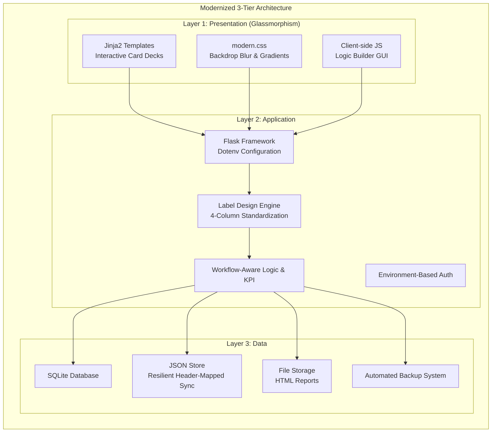

# ProjectFlow Application Architecture

## Architecture Diagram

```mermaid
graph TB
    subgraph "Client Layer"
        Browser[Web Browser]
    end
    
    subgraph "Presentation Layer - Modern Glassmorphism"
        Login[Login Page]
        Calendar[Calendar View]
        Gantt[Gantt View]
        Dashboard[Dashboard View]
        T0Info[T0 Info Page]
        ProgenyInfo[Progeny Info Page]
        Setup[Setup & Administration]
        Header[Unified Navigation Header]
    end
    
    subgraph "Application Layer - Flask App"
        Auth[Security & Env Config<br/>Dotenv Integration]
        Routes[Route Handlers<br/>50+ endpoints]
        
        subgraph "Business Logic"
            DynamicWF[Dynamic Workflow Engine<br/>Card-based Visualization]
            TaskMgr[Task Manager<br/>Auto-offset Scheduling]
            DataSync[Workflow-Aware Data Sync<br/>V3 Auto-calc & Resilient T0 Sync]
            BackupMgr[Backup Manager<br/>Integrated Setup UI]
            CSVGen[Unified CSV Generator<br/>4-Column Standardized Labels]
            ImportExport[Multi-Type Import/Export<br/>Header-Mapped Handler]
        end
    end
    
    subgraph "Data Layer"
        DB[(SQLite DB<br/>database.db<br/>tasks table)]
        WFJSON[Workflows JSON<br/>workflows.json]
        T0JSON[T0 Info JSON<br/>Header-Based Plant Tracking]
        ProgenyJSON[Progeny JSON<br/>Next Gen]
        EditFiles[Edit Data<br/>HTML Files]
        BackupFiles[Backup Files<br/>ZIP Archives]
    end
    
    subgraph "Static Assets"
        CSS[Modern Glassmorphism<br/>modern.css]
        JS[JavaScript<br/>Chart.js & Drag-Drop]
    end
    
    Browser --> Login
    Browser --> Header
    Header --> Calendar
    Header --> Gantt
    Header --> Dashboard
    Header --> T0Info
    Header --> ProgenyInfo
    Header --> Setup
    
    Login --> Auth
    Routes --> DynamicWF
    Routes --> TaskMgr
    Routes --> DataSync
    Routes --> BackupMgr
    Routes --> CSVGen
    Routes --> ImportExport
    
    DynamicWF --> WFJSON
    CSVGen --> WFJSON
    WorkflowMgr --> DB
    TaskMgr --> DB
    DataSync --> DB
    DataSync --> T0JSON
    DataSync --> ProgenyJSON
    ImportExport --> DB
    ImportExport --> T0JSON
    ImportExport --> ProgenyJSON
    BackupMgr --> DB
    BackupMgr --> T0JSON
    BackupMgr --> ProgenyJSON
    BackupMgr --> EditFiles
    BackupMgr --> BackupFiles
    
    T0Info --> EditFiles
    ProgenyInfo --> EditFiles
    
    Browser -.loads.- CSS
    Browser -.loads.- JS
    
    style Browser fill:#e1f5ff
    style DB fill:#ffe1e1
    style WFJSON fill:#f9f7ff
    style Auth fill:#fff4e1
    style BackupMgr fill:#e1ffe1
```



## System Architecture Layers



## Overview
ProjectFlow is a modernized Flask-based web application for managing transformation and breeding projects. It has evolved into a highly intuitive, **GUI-driven platform** that allows users to design complex project lifecycles and custom data-generation patterns (like label printing) without writing code. The architecture is built for robustness, supporting multiple customized project types through a workflow-aware synchronization engine.

## Technology Stack
- **Backend**: Flask (Python) with `python-dotenv` support
- **Database**: SQLite (Relational tasks) + JSON (Workflow templates & Plant data)
- **UI Aesthetic**: **Glassmorphism** (Backdrop blur, semi-transparency, pastel gradients)
- **Frontend**: Jinja2, Vanilla JavaScript, Chart.js
- **Server**: Waitress (Production)

## Core Architecture Components

### 1. Interactive Workflow Engine
The workflow configuration utilizes an **Interactive Card View**:
- **Visual Card Decks**: Project stages are displayed as a sequence of cards with logical connectors.
- **Workflow-Aware Sync**: Data synchronization (like Regen counts) occurs strictly within specific `workflowId` contexts, ensuring accuracy across diverse project types.
- **Automated Scheduling**: Smart offset logic propagates date changes across the project timeline.

### 2. Custom Label Design Engine
A specialized **Logic Builder GUI** allows users to map data fields to CSV columns:
- **Standardized Output**: All labels follow a clean 4-column format (**Project Name, Stage, Date, Count**).
- **Dynamic Row Generation**: Supports fixed row counts or formula-based counts (`V2/6 * 1.1`).
- **Subsequent Task Inheritance**: RS tasks can automatically inherit structure and counts from preceding Pre tasks.

### 3. Resilient Data Synchronization
The application implements a header-mapped synchronization strategy for plant tracking:
- **T0 Info JSON Protection**: Merging logic uses header names rather than positions, preserving manually entered tracking data (gDNA, PCR, etc.) during database updates.
- **Flexible RS Keys**: The sync engine supports multiple task identifiers (RS, RH, Regeneration) and manual ID entry formats.

## Key Routes/Endpoints

| Route | Purpose |
|-------|---------|
| `/` | Unified portal (Calendar/Gantt/Dashboard) |
| `/setup` | Central Admin Hub (Imports, Exports, Backups, WF Config) |
| `/generate_csv/<task_id>` | Unified logic-driven label generation (4-column standard) |
| `/export_rs_data_csv` | Direct JSON-to-CSV export preserving all custom tracking columns |
| `/t0_info` | Editable spreadsheet with dynamic columns for plant tracking |

## Directory Structure
```
ProjectFlow/
├── app.py                    # Core application engine
├── .env.example              # Template for environment-based security
├── sanitize_app.py           # Synthetic data generation and purging tool
├── workflows.json            # Template store for projects and Design Engine config
├── database.db               # SQLite relational storage
├── t0_info.json              # Main plant tracking spreadsheet
├── progeny_info.json         # Generation tracking spreadsheet
├── static/
│   └── modern.css            # Refined Glassmorphism theme
└── templates/
    ├── base.html            # Unified header and modernized modals
    ├── setup.html           # Admin hub with Card Deck Workflow Editor
    └── ...                  # Specialized views (Gantt, Dashboard, etc.)
```

---

**Last Updated**: March 21, 2026
**Version**: 2.7 (Advanced Filtering & Print-Ready Portal)
**Maintainer**: GELab Team

## Revision History

### March 21, 2026 - Version 2.7 Update Summary (Reporting & Visibility)
*   **Professional Print View**: Implemented specialized CSS `@media print` rules and a "⎙ Print" utility. Automatically strips UI chrome (sidebars, nav, buttons) and optimizes the calendar grid for high-contrast, full-page physical copies. **Includes color preservation logic** to ensure project-specific coding remains visible on paper.
*   **Multi-Criteria Calendar Filtering**: Expanded the calendar header to support simultaneous filtering by both Lab Member and Project Type (AMT, Transformation, etc.), allowing for highly specific schedule views.

### March 21, 2026 - Version 2.6 Update Summary (Production Hardening)
*   **Global Search & Quick-Jump**: Integrated a high-speed search bar in the header for instant project retrieval. Updated the Gantt chart to allow one-click "jumps" to specific project start dates on the calendar.
*   **Atomic Data Integrity**: Implemented a thread-locked, multi-stage JSON save mechanism (`atomic_save_json`) across all data stores to prevent file corruption during concurrent access.
*   **Workflow UI Precision**: Added auto-scrolling and visual highlighting when editing specific workflow steps, significantly reducing navigation friction in complex project setups.

### March 21, 2026 - Version 2.5 Update Summary (Personnel & UI Refinement)
*   **Lab Member Assignment System:** Integrated a dedicated personnel management layer (separate from login users) with `lab_members.json` storage.
*   **Multi-Select Task Assignment:** Implemented a multi-select dropdown in task modals for assigning one or more lab members to specific workflow steps.
*   **Granular Calendar Filters:** Added personnel-based filtering across Calendar, Gantt, and Dashboard views, including initials display on task cards.
*   **Adaptive Multi-View Portal:** Introduced specialized **Weekly** and **Daily** views to the calendar to handle high task density without layout distortion.
*   **Sticky UI Pattern:** Re-engineered modals with a "Sticky Action Footer" and scrollable bodies to ensure "Save" and "Delete" buttons remain visible on low-resolution displays.
*   **Workflow-Agnostic Detection:** Standardized the identification of "Start" and "Pre" tasks across all project types (AMT, Transformation, etc.), fixing dashboard visibility for varied workflows.
*   **Robust Duplicate-Key Handling:** Refined the task update engine to match both `key` and `name`, preventing accidental date shifts in workflows with recurring task keys.
*   **Refined Data Sync Heuristic:** Optimized the T0 synchronization logic to accurately distinguish between numeric DNA IDs and summary count lines, ensuring zero data loss during CSV imports.

### March 18, 2026 - Version 2.4 Update Summary (Full Day Session)
*   **Environment-Based Security:** Transitioned sensitive credentials (Secret Key, Hashes) to environment variables with `.env` file support.
*   **Workflow-Aware Synchronization:** Completely rebuilt the V3 (Regen count) update logic to be `workflowId` specific, ensuring accurate pairing between Pre and RS stages across all project types.
*   **Resilient Data Merging:** Implemented header-based mapping for `t0_info.json` synchronization, preventing data loss and preserving custom tracking columns.
*   **Standardized Label Generation:** Refined the CSV Label engine to a clean 4-column format with professional headers and robust row count calculations.
*   **Flexible Project Importer:** Upgraded the "Old Projects" importer to support multiple workflow types and optional V1/V2/V3 data fields via a new CSV template.
*   **Data Sanitization Engine:** Created `sanitize_app.py` to securely purge proprietary data and inject high-quality synthetic plant science datasets for public demonstration.
*   **Robust ID Parsing:** Improved description parsing to handle manual entry of plant IDs without requiring specific CSV formats.

### March 7, 2026 - Version 2.3 Update Summary
*   **Interactive Workflow Cards:** Replaced the static table view with a dynamic Card Deck UI.
*   **Custom Label Design Engine:** Implemented a GUI-driven builder for mapping CSV columns without backend changes.
*   **Hierarchical CSV Generation:** Refined backend to support multi-line projects and sub-project iteration.
*   **Expanded Logic Blocks:** Unified specialized Germplasm-specific labeling patterns into the main engine.
