# ProjectFlow: An Agile LIMS Platform

ProjectFlow is a modernized, logic-driven Laboratory Information Management System (LIMS) designed to streamline complex plant transformation and breeding workflows. Developed with a focus on flexibility and extensibility, it moves beyond hardcoded project tracking to provide a fully configurable platform for modern laboratory environments.

## 🚀 Key Features for LIMS Administration

### 1. Dynamic Workflow Engine
Unlike traditional static systems, ProjectFlow features a template-driven engine. Users can define custom project types, stage sequences, and automated scheduling offsets directly through an interactive **Card Deck UI**. This ensures the system can adapt to evolving lab protocols without backend code changes.
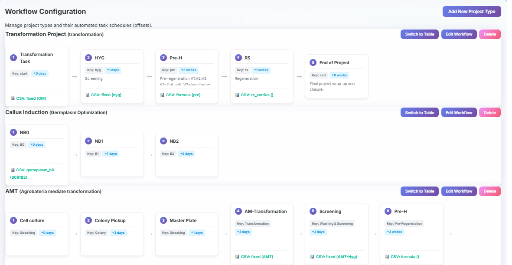

### 2. Custom Label Design Engine
A core challenge in LIMS is managing diverse data generation needs at different project stages. ProjectFlow includes a **GUI-driven Logic Builder** that allows administrators to:
*   Map dynamic data sources (Identifiers, Task Dates, Names) to CSV columns.
*   Configure row generation rules (Fixed counts vs. Formula-based counts).
*   Implement hierarchical iteration for multi-line sub-projects.
_logic.png)

### 3. Integrated Plant Tracking & Synchronization
ProjectFlow ensures seamless continuity between high-level project scheduling and granular plant tracking:
*   **Bidirectional Sync:** Real-time synchronization between project tasks and T0/Progeny plant tracking spreadsheets.
*   **Data Inheritance:** Automated structural propagation between stages (e.g., RS stages inheriting Pre-regen structure) ensures data integrity across the project lifecycle.
*   **Dynamic Spreadsheets:** In-browser editable tables with manual column management for tracking PCR results, genetic data, and reporting.
    .png)
    .png)
*   **Rapid Plant Retrieval:** Integrated search functionality allows Greenhouse (GH) staff to instantly locate plants by ID to verify harvest status or disposal records.
    

### 4. Advanced System Administration
ProjectFlow provides a centralized hub for managing lab resources and data integrity:
*   **Personnel Management & Task Assignment:** A dedicated layer for task assignment, allowing managers to coordinate multiple lab members independently of system login accounts. Features multi-select assignments and instant schedule filtering.
    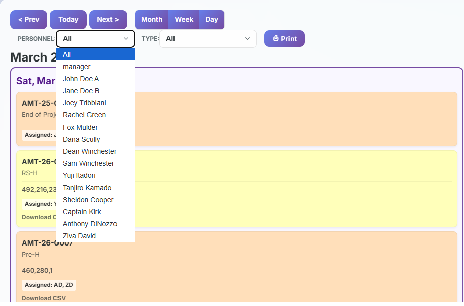
    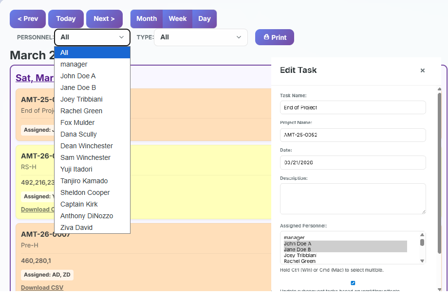
    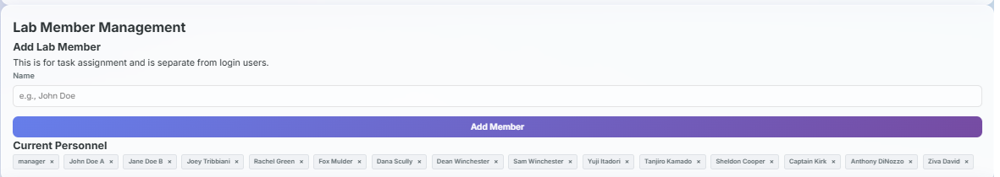
*   **Bulk Data Population:** Streamline data entry with bulk HTML/Edit data uploads, automatically linking detailed analysis reports to hundreds of plant entries in seconds.
    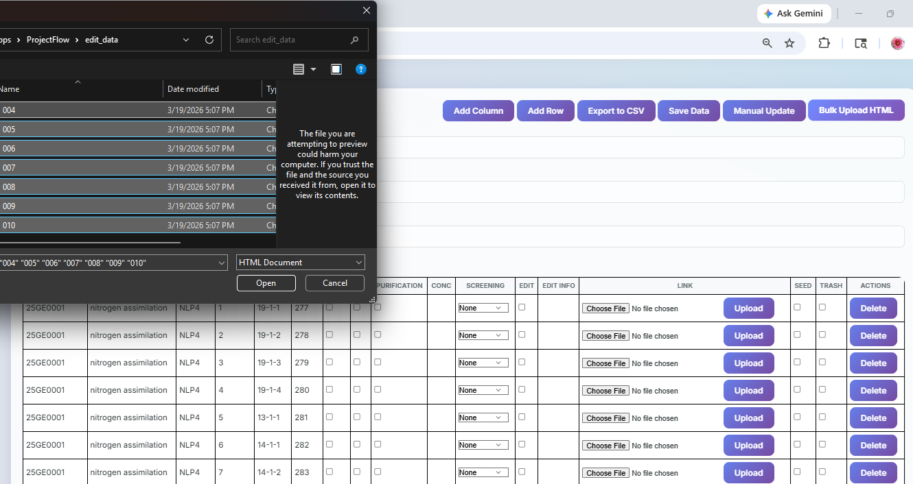
*   **Multi-Type Import/Export:** Robust support for migrating legacy project data and bulk-importing plant tracking results from CSV formats.
    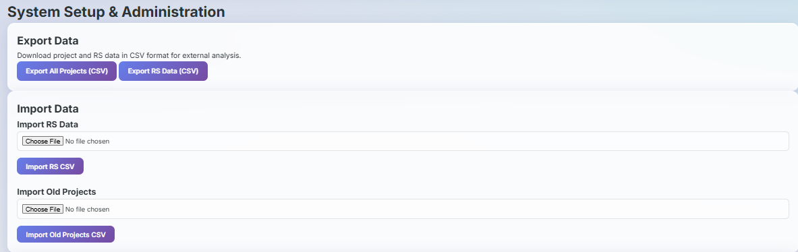

### 5. Modern Presentation & Multi-View Navigation
ProjectFlow provides a sleek, professional interface featuring backdrop blurs and pastel-coded visualization for enhanced readability. The system includes an **Adaptive View Portal** to handle varying task densities and complex resource management:

*   **Monthly Oversight:** A high-level grid view for long-term planning, featuring personnel initials and project status indicators.
    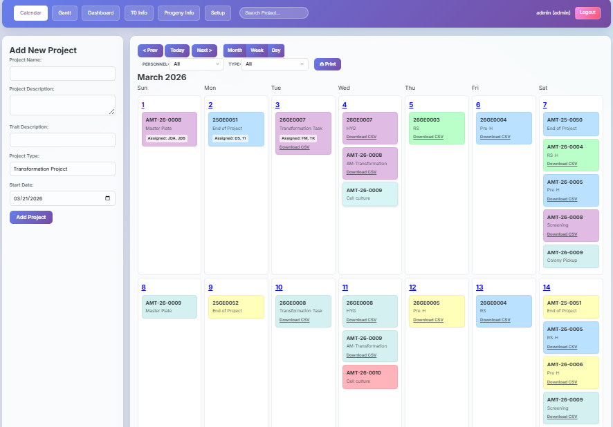
*   **Weekly Coordination:** A detailed 7-day layout that provides significantly more vertical space for high-density task lists, ideal for daily lab management.
    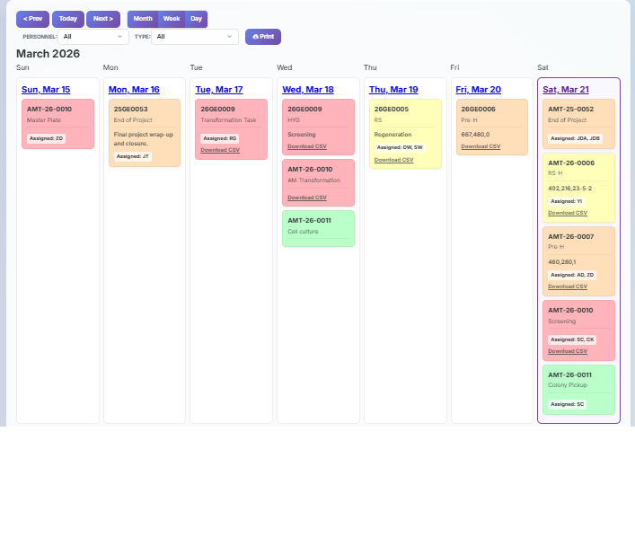
*   **Daily Detail:** A focused perspective on a single day’s requirements, displaying full task descriptions and expanded personnel assignments.
    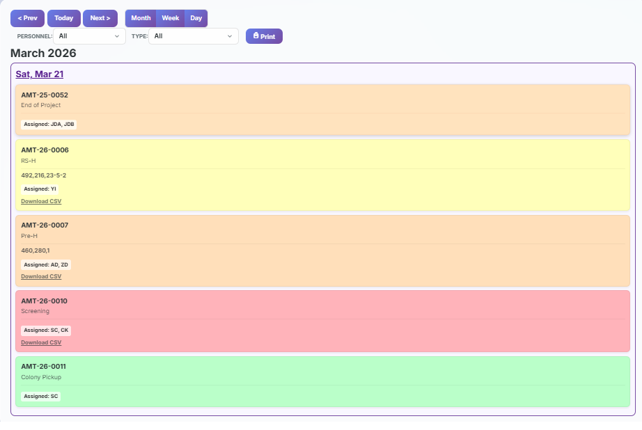
*   **Institutional Reporting (Print Ready):** A specialized "Print-to-Physical" utility that strips UI elements and optimizes the calendar grid for high-contrast paper copies.
    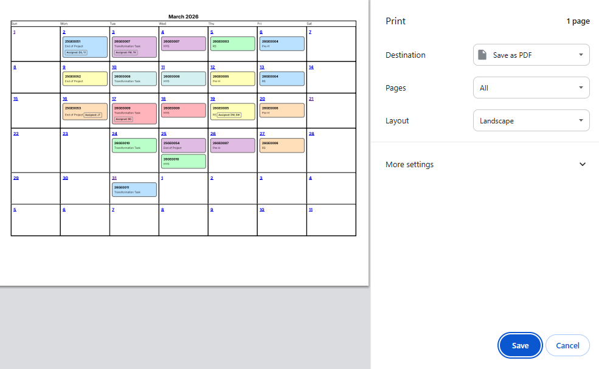
*   **Gantt Chart Visualization:** A macro-level timeline for tracking project lifecycles, dependencies, and overall lab throughput.
    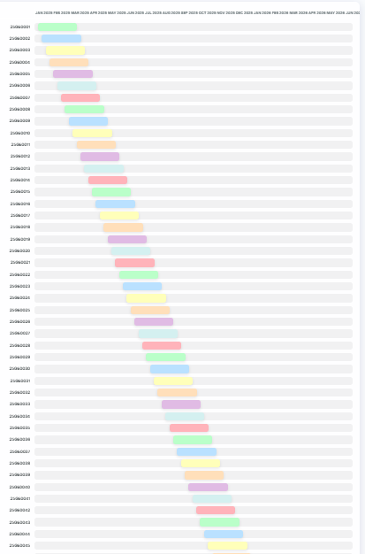
*   **Real-time KPI Dashboards:** Instant visualization of lab performance metrics, including Transformation Efficiency (TF%) and Regeneration rates across all active projects.
    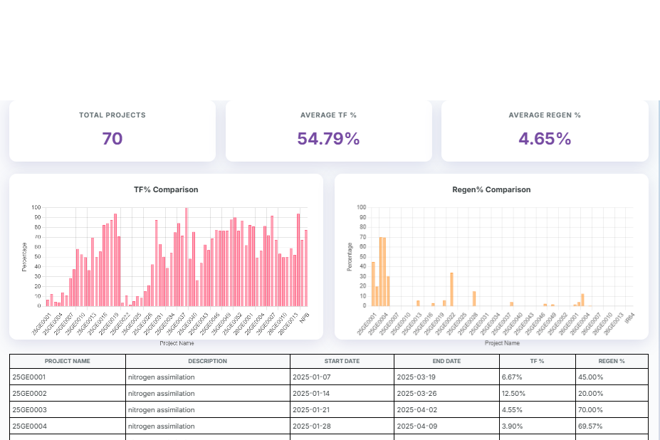
*   **Granular Resource Filtering:** Quickly isolate schedules by specific lab members or project types (e.g., AMT vs. Transformation) to manage workloads and priorities effectively.
    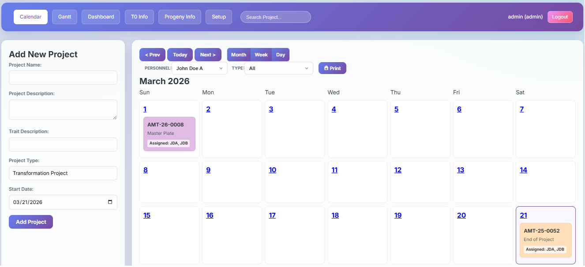
    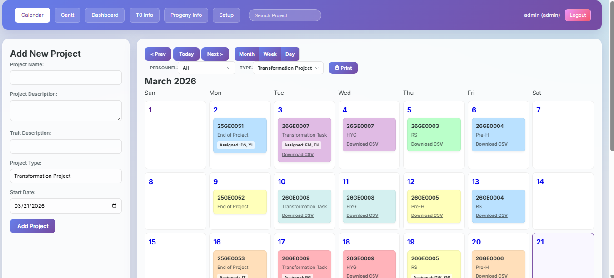

## ⚙️ Installation & Setup

1. **Clone the repository:**
   ```bash
   git clone https://github.com/yourusername/projectflow.git
   cd projectflow
   ```

2. **Install dependencies:**
   ```bash
   pip install -r requirements.txt
   ```

3. **Configure Environment Variables:**
   Copy the `.env.example` file to `.env` and fill in your details:
   * `FLASK_SECRET_KEY`: A random string for session security.
   * `APP_USERNAME`: Your administrative username.
   * `APP_PASSWORD_HASH`: A secure hash of your password (use `encrypt_password.py`).

4. **Initialize the Database:**
   ```bash
   flask initdb
   ```

5. **(Optional) Inject Demo Data:**
   Run the sanitization script to clear any existing data and inject professional synthetic plant science projects:
   ```bash
   python sanitize_app.py
   ```

6. **Run the Application:**
   ```bash
   python app.py
   ```

## 🛠 Technology Stack
*   **Backend:** Python (Flask)
*   **Frontend:** HTML5, CSS3 (Modern Glassmorphism), Vanilla JavaScript, Chart.js
*   **Database:** SQLite (Relational) & JSON (Template Store)
*   **Deployment:** Waitress WSGI Server

## 🔒 Reliability & Security
*   **Triple-Redundant Backups:** Automated daily, startup, and shutdown backups with ZIP-based restoration.
    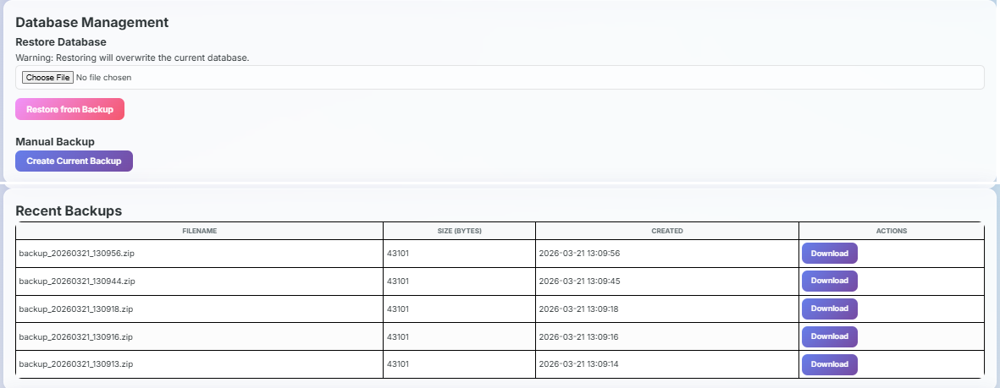
*   **Secure Authentication:** Session-based authentication using scrypt-hashed credentials.
*   **Data Integrity:** Robust parsing logic designed to handle both legacy formats and modernized, logic-driven data structures.

---

**ProjectFlow** demonstrates an advanced understanding of systems architecture, user-centric design, and the complex data lineage requirements inherent in professional laboratory environments.
