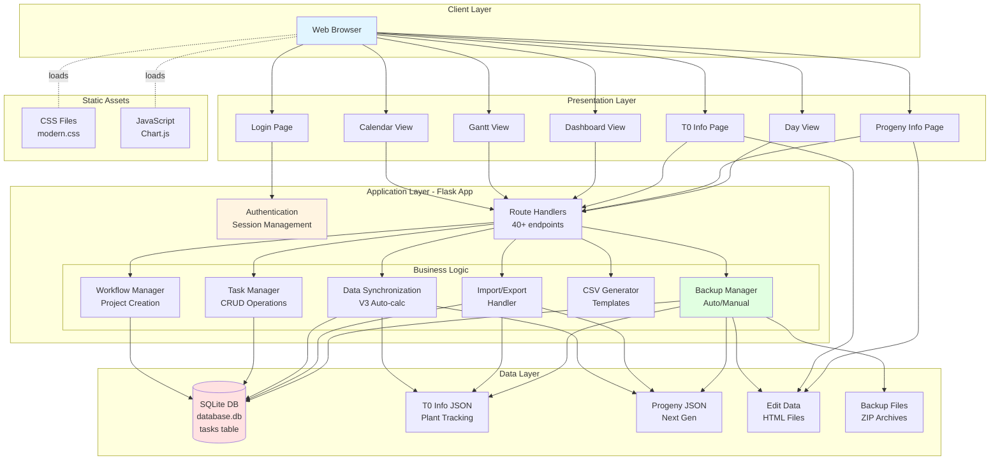
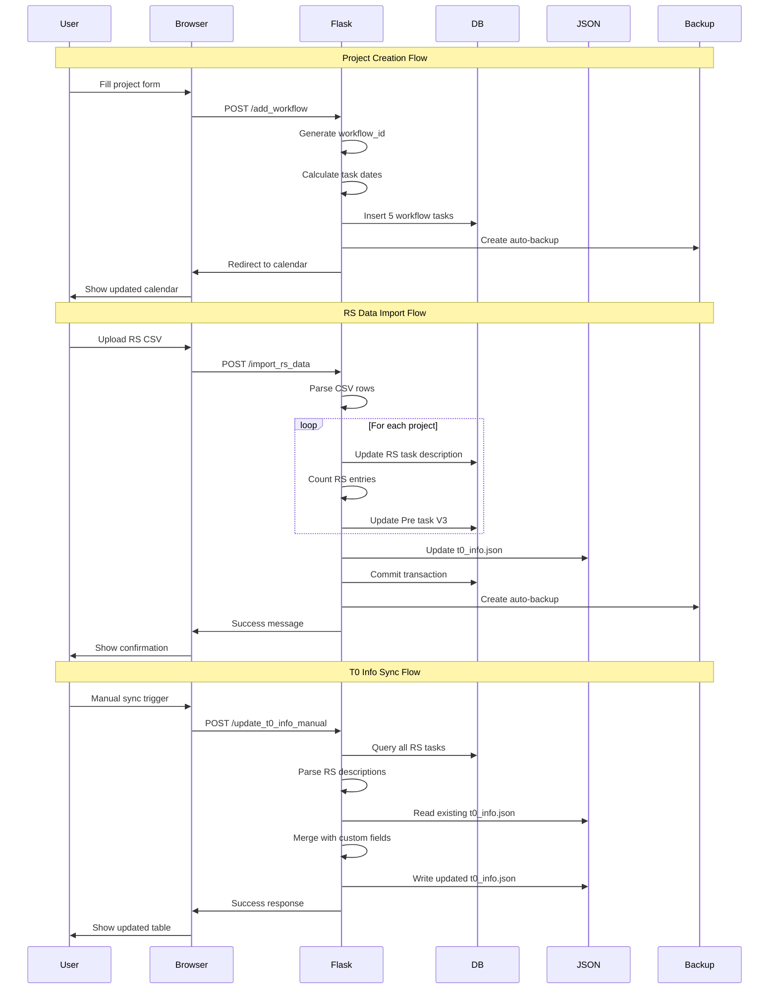
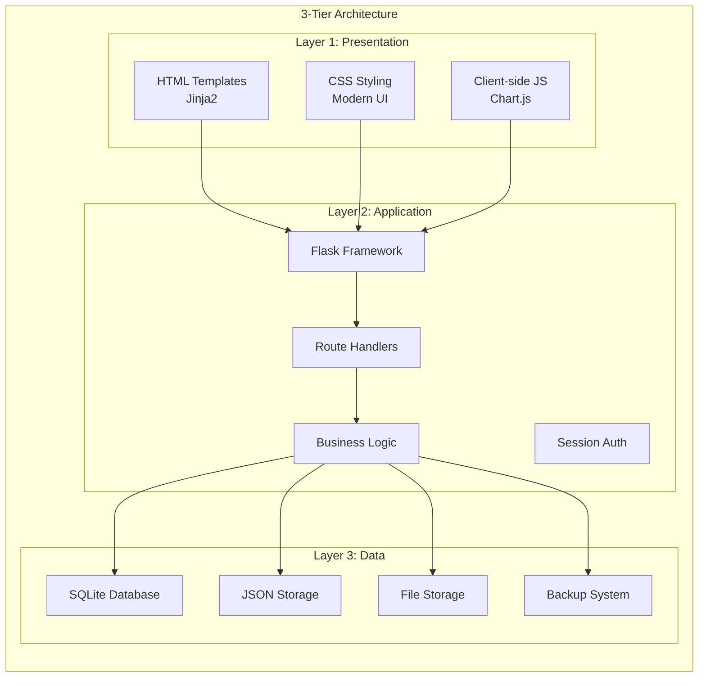
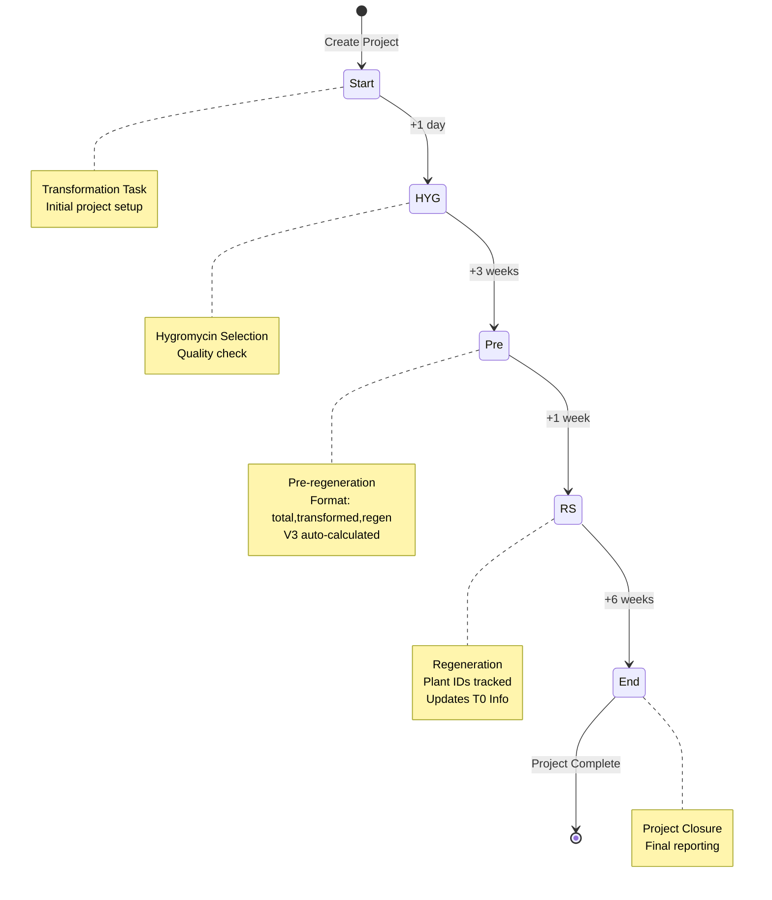
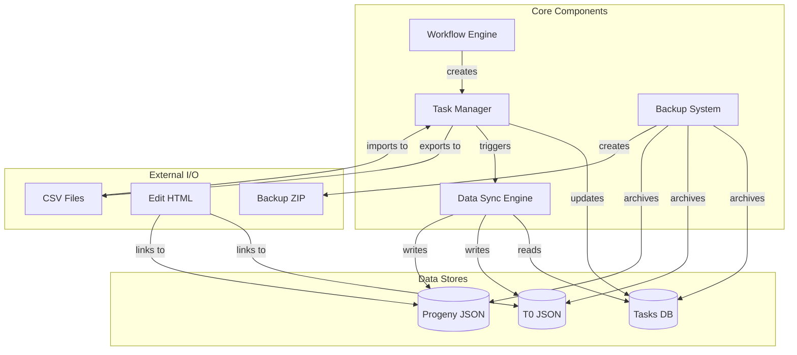

# ProjectFlow Application Architecture

## Architecture Diagram



## Data Flow Diagram



## System Architecture Layers



## Workflow State Machine



## Component Interaction Map



## Overview
ProjectFlow is a Flask-based web application for managing **transformation projects** in a laboratory setting (appears to be for plant genetic engineering/breeding). It tracks projects through multiple workflow stages with calendar, Gantt, and dashboard views.

## Technology Stack
- **Backend**: Flask (Python web framework)
- **Database**: SQLite (database.db)
- **Frontend**: HTML templates (Jinja2), CSS, JavaScript
- **Charts**: Chart.js for visualizations
- **Server**: Can run with Flask dev server or Waitress (production)

## Core Architecture Components

### 1. Database Layer (schema.sql)
Single table: `tasks`
- Stores all project tasks and workflow stages
- Key fields: `workflowId` (groups tasks into projects), `workflowTaskKey` (stage identifier), `date`, `description`, `projectName`, `trait_description`

### 2. Workflow System
Predefined **Transformation Workflow** with 5 stages:
1. **start** - Transformation Task (Day 0)
2. **hyg** - hygromycin selection (+1 day)
3. **pre** - Pre-regneration (+3 weeks) - stores counts as "total,transformed,regen"
4. **rs** - Regeneration (+1 week) - stores plant IDs and values
5. **end** - Project closure (+6 weeks)

### 3. Main Features

#### A. Project Management
- Create new transformation projects with auto-generated workflow tasks
- Each project gets unique `workflowId` and color
- Tasks automatically scheduled based on offsets

#### B. Multiple View Modes
- **Calendar View**: Monthly calendar showing all tasks
- **Gantt View**: Timeline visualization of projects
- **Dashboard**: KPI metrics (TF%, Regen%) with filtering
- **Day View**: Detailed task list for specific date

#### C. Data Management
- **T0 Info** (t0_info.json): Tracks plant samples from RS stage with custom fields (gDNA, PCR, Screening, etc.)
- **Progeny Info** (progeny_info.json): Tracks next-generation plants
- Both support file uploads for edit data (HTML files)

#### D. Import/Export
- Export projects to CSV
- Export RS (Release Strategy) data
- Import RS data from CSV (updates RS descriptions and recalculates V3 counts)
- Import old projects from CSV
- Generate stage-specific CSV templates (OM, HYG, Pre, RS)

#### E. Backup System
- Automatic backups on startup, shutdown, and every 24 hours
- Manual backup creation
- Restore from ZIP backups
- Keeps last 10 backups

### 4. Key Routes/Endpoints

| Route | Purpose |
|-------|---------|
| `/` | Main page (calendar/gantt/dashboard) |
| `/login` | User authentication |
| `/logout` | User logout |
| `/add_workflow` | Create new project |
| `/update_task` | Edit task date/description |
| `/delete_task/<id>` | Delete entire project |
| `/delete_single_task/<id>` | Delete task and subsequent stages |
| `/api/move_task` | Move task to different date (drag-drop) |
| `/t0_info` | Manage T0 plant tracking |
| `/save_t0_info` | Save T0 info JSON |
| `/delete_t0_info_row` | Delete T0 info row |
| `/update_t0_info_manual` | Manually trigger T0 info sync |
| `/progeny_info` | Manage progeny plant tracking |
| `/save_progeny_info` | Save progeny info JSON |
| `/delete_progeny_info_row` | Delete progeny info row |
| `/import_progeny_template` | Import progeny CSV template |
| `/export_csv` | Export all projects |
| `/export_rs_data_csv` | Export RS data |
| `/import_rs_data` | Import release strategy data |
| `/import_old_projects` | Import legacy projects from CSV |
| `/upload_edit_data` | Upload T0 edit HTML file |
| `/bulk_upload_edit_data` | Bulk upload T0 edit files |
| `/view_edit_data/<filename>` | View T0 edit HTML |
| `/upload_progeny_edit_data` | Upload progeny edit HTML file |
| `/bulk_upload_progeny_edit_data` | Bulk upload progeny edit files |
| `/view_progeny_edit_data/<filename>` | View progeny edit HTML |
| `/generate_project_csv/<workflow_id>` | Generate OM CSV template |
| `/generate_hyg_csv/<workflow_id>` | Generate HYG CSV template |
| `/generate_pre_csv/<workflow_id>` | Generate Pre CSV template |
| `/generate_rs_csv/<workflow_id>` | Generate RS CSV template |
| `/backup` | Create manual backup |
| `/restore` | Restore from backup |
| `/backups` | List all backups |
| `/list_backups` | Get backups JSON |
| `/download_backup/<filename>` | Download backup file |
| `/check_db_status` | Database health check |
| `/day_view/<date>` | Daily task view |
| `/get_task_details/<task_id>` | Get task details JSON |

### 5. Authentication
- Simple session-based login
- Username: 
- Password: Hashed using scrypt (configured in app.py)
- All routes except login require authentication via `@app.before_request` decorator

### 6. Data Synchronization Logic

#### Auto-calculation Flow:
1. When RS task is updated → automatically counts entries
2. Updates V3 (regen count) in Pre task description
3. Triggers `update_t0_info_json()` to sync JSON file with database

#### Pre Task Description Format:
- Format: "total,transformed,regen" (e.g., "500,250,50")
- V1: Total plants transformed
- V2: Successfully transformed plants
- V3: Regenerated plants (auto-calculated from RS entries)

#### T0 Info Synchronization:
- Reads RS task descriptions from database
- Merges with existing t0_info.json data (preserves custom columns)
- Updates RS-specific fields while maintaining user edits
- Maintains data integrity across project updates

### 7. Directory Structure
```
ProjectFlow/
├── app.py                    # Main Flask application
├── schema.sql                # Database schema
├── database.db               # SQLite database
├── requirements.txt          # Python dependencies (Flask, Werkzeug)
├── run_ProjectFlow.py        # Production server launcher (Waitress)
├── encrypt_password.py       # Password hashing utility
├── hash_password_instruction.md
├── test_hash.py              # Password test utility
├── templates/                # HTML templates
│   ├── base.html            # Base template with common layout
│   ├── index.html           # Main calendar/gantt/dashboard
│   ├── t0_info.html         # T0 plant tracking table
│   ├── progeny_info.html    # Progeny plant tracking table
│   ├── day_view.html        # Daily task detail view
│   ├── login.html           # Authentication page
│   └── backups.html         # Backup management page
├── static/                   # CSS files
│   ├── modern.css           # Main stylesheet
│   └── index.css            # Additional styles
├── edit_data/                # T0 edit HTML files
├── progeny_edit_data/        # Progeny edit HTML files
├── backups/                  # Database backups (ZIP files)
├── t0_info.json             # T0 plant tracking data
├── progeny_info.json        # Progeny plant tracking data
└── addup/                    # Additional data folder
```

### 8. Special Features

#### Multi-line Descriptions
- Projects can have multiple entries in start task description
- Creates sub-projects with distributed CSV rows
- Each line in start task description corresponds to a line in pre task description
- Dashboard shows separate entries for each sub-project

#### V3 (# of plantlets, Regeneration ) Auto-calculation
- Counts RS entries in description (format: "ID,PlantID,Value")
- Automatically updates Pre task's V3 value
- Triggered on RS data import or task updates

#### Color Coding
- Each project gets a unique color from predefined palette
- 7 colors cycling: red, blue, green, yellow, purple, teal, orange
- Used consistently across all views

#### Filtering Capabilities
- **Dashboard filters**:
  - Filter by trait description
  - Filter by project description (multi-select)
  - Filter by start date range
  - Default: Shows 8 most recent projects when no filter applied

#### Drag-and-Drop Calendar
- Tasks can be moved to different dates via drag-drop
- Optional: Update subsequent tasks automatically
- Uses `/api/move_task` endpoint

#### CSV Template Generation
- Each workflow stage (OM, HYG, Pre, RS) can generate CSV templates
- Pre and RS templates use V2 count to calculate row numbers
- Formula: `ceil((v2 / 6) * 1.1)` for row count
- Supports multi-line project descriptions with proportional row distribution

### 9. Key Functions

#### Core Utility Functions
- `get_db()`: Database connection with row factory
- `query_db()`: Execute SQL queries
- `add_offset_to_date()`: Calculate task dates based on workflow offsets
- `get_next_workflow_id()`: Generate unique workflow IDs

#### Calendar & View Functions
- `get_calendar_data()`: Build monthly calendar grid
- `get_projects_for_gantt()`: Prepare project data for Gantt chart
- `get_gantt_timeline()`: Calculate timeline boundaries
- `get_processed_projects()`: Process projects with KPI calculations
- `get_dashboard_kpis()`: Calculate dashboard metrics

#### Data Processing Functions
- `parse_pre_description()`: Extract V1, V2, V3 from Pre task
- `update_pre_task_v3()`: Auto-update V3 based on RS entries
- `update_t0_info_json()`: Synchronize T0 info with database
- `add_project_from_csv()`: Create projects from CSV import

#### Backup Functions
- `create_backup()`: Create timestamped ZIP backup
- `cleanup_old_backups()`: Keep only recent backups
- `schedule_auto_backup()`: Background backup scheduler
- `startup()`: Initialize app with backup
- `shutdown_backup()`: Create backup on exit

### 10. Data Flow

#### Project Creation Flow:
```
User submits form → add_workflow() → 
  Generate workflow_id → 
  Calculate task dates → 
  Insert 5 tasks into database → 
  Create backup → 
  Redirect to calendar
```

#### RS Data Import Flow:
```
Upload CSV → import_rs_data() → 
  Parse CSV rows → 
  Find RS task for each project → 
  Append entries to RS description → 
  update_pre_task_v3() (for each project) → 
  update_t0_info_json() → 
  Commit database → 
  Redirect
```

#### T0 Info Update Flow:
```
Query all RS tasks from database → 
  Parse RS descriptions → 
  Read existing t0_info.json → 
  Merge new RS data with existing custom fields → 
  Sort by project name and DNA ID → 
  Write to t0_info.json
```

### 11. Configuration

#### Important Settings (app.py)
- `app.secret_key`: Session encryption key (should be changed in production)
- `DATABASE`: 'database.db'
- `EDIT_DATA_FOLDER`: 'edit_data'
- `PROGENY_EDIT_DATA_FOLDER`: 'progeny_edit_data'
- `PROGENY_INFO_FILE`: 'progeny_info.json'
- `USERNAME`: 'gelab'
- `HASHED_PASSWORD`: scrypt hash

#### Workflow Configuration
- Defined in `workflows` dictionary (app.py lines 90-99)
- Easily extensible to add new workflow types
- Each task has: key, name, description, offset

#### Backup Settings
- Auto-backup interval: 24 hours
- Number of backups to keep: 10
- Backup contents: database.db, JSON files, edit_data folders

### 12. Security Considerations

- Session-based authentication with secret key
- Password hashed using scrypt (Werkzeug)
- All routes protected except `/login` and `/static`
- File uploads restricted to specific types (.csv, .html)
- SQL injection protection via parameterized queries
- No exposed API keys or credentials

### 13. Performance Characteristics

- SQLite suitable for small to medium workloads
- No connection pooling (single-threaded database access)
- Backups may block requests briefly
- Chart.js rendering done client-side
- No caching layer implemented

### 14. Future Enhancement Opportunities

- Add user roles and permissions
- Implement RESTful API for external integrations
- Add real-time notifications for task updates * Done by Dashboard app. 
- Implement database migrations system
- Add full-text search capabilities
- Add project templates beyond transformation * To simplify, other app was spined off from this app.
- Implement audit logging for all changes
- Add email notifications for upcoming tasks
- Mobile-responsive design improvements
- Export to Excel with formatting *Instead, csv file was used for the broad compatibility. 

## Getting Started

### Installation
```bash
pip install -r requirements.txt
```

### Initialize Database
```bash
flask --app app initdb
```

### Run Development Server
```bash
python app.py
```
Access at: http://localhost:5003

### Run Production Server
```bash
python run_ProjectFlow.py
```

### Change Password
```bash
python encrypt_password.py
# Copy generated hash to app.py HASHED_PASSWORD variable
```

---

**Last Updated**: January 29, 2026
**Version**: 1.0
**Maintainer**: GELab Team
